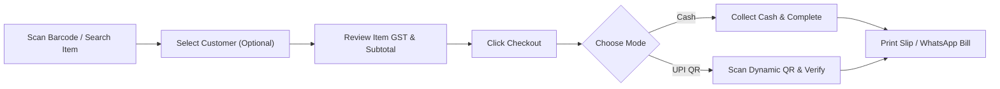

# Unidex ERP — Cashier & Store Operator Quick-Start Guide
**Document Version:** 1.1.0 (Sprint 1 Release)  
**Target Audience:** Cashiers, Counter Operators, Retail Billing Staff, Store Supervisors  
**Applicable Modules:** QuickBill POS, Sales Register, Thermal Print Engine

---

## 1. Fast Counter Billing Workflow (Step-by-Step)

The Unidex QuickBill POS interface is optimized for rapid checkout during peak store hours. A complete transaction takes under 5 seconds.



### Step 1: Adding Items to Cart
There are two ways to add products to the active bill:
1. **Barcode / QR Scanner (Recommended for Speed):**
   - Click the blue **Scan** button (with camera icon) on the top search bar.
   - Point the handheld or integrated camera at the item's barcode.
   - The system instantly matches the barcode, resolves the product name, MRP, applicable GST rate, and adds `1` unit to the cart.
   - For additional quantities, scan the item again or adjust directly in the cart.
2. **Instant Search & Touch Selection:**
   - Type the product name or ID in the search input (`Scan barcode or type name...`).
   - The product grid dynamically filters down.
   - Click/tap any product card to immediately add it to the cart.

### Step 2: Adjusting Quantities & Discounts
- In the right-hand **Cart** drawer:
  - Click `+` or `-` beside any item to increment or decrement quantity.
  - Click the **Trash** icon to discard an erroneous scan.
  - Review the real-time tax breakdown tags (e.g., `+5% GST`, `+18% GST`) automatically populated per item.

### Step 3: Customer Assignment
- Default is **Walk-in Customer**.
- For regular customers or ledger credit customers:
  - Click the **Customer** dropdown card above the cart.
  - Select an existing customer from the ledger list to automatically capture their phone number and link the invoice to their purchase history.
  - Their outstanding balance will be visible right below their name.

### Step 4: Settlement (Payment Method)
1. Click the large blue **Checkout** button at the bottom of the cart.
2. In the **Complete Settlement** dialog, review the grand total and pick one of the payment options:
   - **Cash Paid:** Cashier receives physical currency notes and confirms the exchange.
   - **UPI QR:** A dynamic Bharat UPI QR code is instantly rendered on-screen encoded with the merchant's UPI ID, store name, and exact order total. The customer scans using Google Pay, PhonePe, Paytm, or BHIM.
3. Click **Complete Order**.
   - Inventory levels decrement instantly in the background.
   - The **Thermal Receipt & WhatsApp Sharing Modal** opens automatically.

---

## 2. Thermal Printer Configuration (80mm vs 58mm)

Unidex ERP includes a dedicated thermal receipt engine engineered for USB, Bluetooth, and network thermal roll printers.

### Width Comparison Guide

| Feature / Spec | 80mm Standard POS (Recommended) | 58mm Compact POS (Mobile / Bluetooth) |
| :--- | :--- | :--- |
| **Print Width (Inches)** | 3.15 inches (approx. 72mm printable width) | 2.28 inches (approx. 48mm printable width) |
| **Character Columns** | 42 to 48 columns (monospace font) | 30 to 32 columns (monospace font) |
| **Best Used For** | Supermarkets, electronics counters, departmental stores with detailed item names & HSN codes. | Small kiosks, tea/food counters, quick retail counters with 1-3 line items. |
| **Layout Behavior** | Full item description, unit price, HSN code, and tax percentage visible side-by-side. | Condensed single-column item names, HSN codes abbreviated, compact line wraps. |

### Browser Print Dialog Setup (One-Time Setup)

When printing thermal receipts for the first time on a cashier workstation, configure the browser print dialog as follows:

1. Click **Print Thermal Slip** inside the receipt modal.
2. In the Chrome/Edge Print Dialog:
   - **Destination:** Select your thermal printer (e.g., *POS-80*, *Epson TM-T82*, *TVS RP-3160*, or *Everycom 58mm*).
   - **Paper Size:** Select **Roll Paper 80 x 297 mm** (for 80mm) or **58 x 210 mm / User Defined** (for 58mm).
   - **Margins:** Set explicitly to **None** or **Minimum**. (Crucial to prevent unwanted paper feeds).
   - **Options:** 
     - **Uncheck** "Headers and footers" (prevents browser date, URL, and page numbering from wasting roll space).
     - **Check** "Background graphics" (ensures clean divider lines and badges render crisply).
3. Click **Print**. The printer firmware will cut or feed cleanly at the receipt footer.

> [!TIP]
> The receipt modal remembers your selected width (**80mm** or **58mm**) during your active counter session. Toggle the switch at the top-left of the preview window before printing.

---

## 3. Cashier Keyboard Shortcuts Cheat-Sheet

Keep this reference card near the cashier counter monitor for high-speed, mouse-free operations:

| Action / Operation | Key Shortcut | Function Description |
| :--- | :--- | :--- |
| **Focus Search / Barcode** | `Alt + S` or `/` | Focuses the search input ready for scanning or typing SKU. |
| **Trigger Camera Barcode** | `Alt + B` | Opens the live camera scanner modal. |
| **Select Walk-in Customer** | `Alt + C` | Expands or collapses the customer selection picker. |
| **Increase First Item Qty** | `Alt + +` | Increments the top cart item. |
| **Proceed to Checkout** | `Enter` (from Search/Cart) | Opens the settlement / payment modal. |
| **Fast Cash Settlement** | `Alt + 1` | Instantly selects Cash mode. |
| **Fast UPI QR Settlement** | `Alt + 2` | Instantly displays the UPI QR code modal. |
| **Print Thermal Receipt** | `Ctrl + P` | Triggers the browser thermal print workflow. |
| **Dismiss / Close Modals** | `Escape` | Closes scanner, receipt modal, or checkout popup. |

---

## 4. WhatsApp Invoice Sharing Guide

Unidex ERP features direct **1-Click WhatsApp Invoice Dispatching**, eliminating SMS gateway costs and paper roll waste.

### How WhatsApp Sharing Works
1. Once checkout completes or when clicking the **Receipt** icon in the **Sales Register**, open the receipt dialog.
2. **If Customer Phone is Saved:**
   - Click **Share on WhatsApp**.
   - The browser automatically launches `https://wa.me/91<Phone>?text=<InvoicePayload>`.
   - On desktop workstations with WhatsApp Web or the WhatsApp Desktop App logged in, the chat opens with the complete receipt pre-formatted in bold and monospace typography.
   - Press **Send** to deliver.
3. **If Walk-in Customer (No Phone pre-recorded):**
   - Click **Copy** to place the entire formatted text slip on the system clipboard.
   - Alternatively, click **Share on WhatsApp** without a preset phone to choose any contact or conversation in WhatsApp Web.

### Specimen WhatsApp Receipt Message
```text
🧾 *TAX INVOICE - UNIDEX ERP*
────────────────────────
*Invoice No:* INV-1718012345
*Date:* 05/10/2026, 10:45 AM
*Customer:* Rahul Sharma
*GSTIN:* 22AAAAA0000A1Z5
────────────────────────
*ITEMS PURCHASED:*
1. *iPhone 15 Pro*
   Qty: 1 x ₹134,900 (GST 18%: ₹24,282.00) = *₹159,182.00*

2. *Wireless Keyboard*
   Qty: 2 x ₹2,499 (GST 18%: ₹899.64) = *₹5,897.64*
────────────────────────
*Subtotal:* ₹139,898.00
*Total GST:* ₹25,181.64
*Grand Total:* ₹165,079.64
*Payment:* CASH
────────────────────────
_Thank you for your business!_
```

---

## 5. Visual Theme Toggle (Dark Mode vs Light Mode)

Cashiers working under bright daylight or dim warehouse conditions can toggle display aesthetics:
- Click the **Sun / Moon** icon in the top header or sidebar.
- **Light Mode:** High-contrast crisp white background for bright checkout counters under overhead sunlight or fluorescent tubes.
- **Dark Mode:** Deep slate `#0A0A0A` theme for evening shifts, reducing operator eye strain and conserving monitor power.
