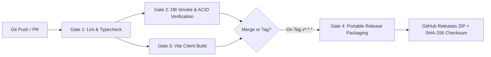
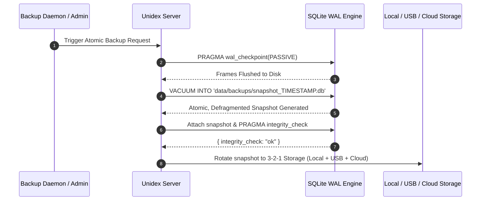
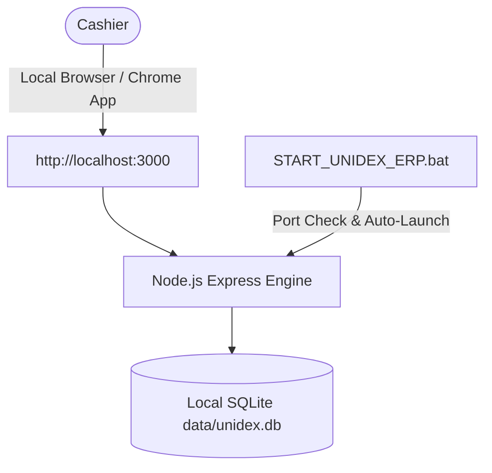
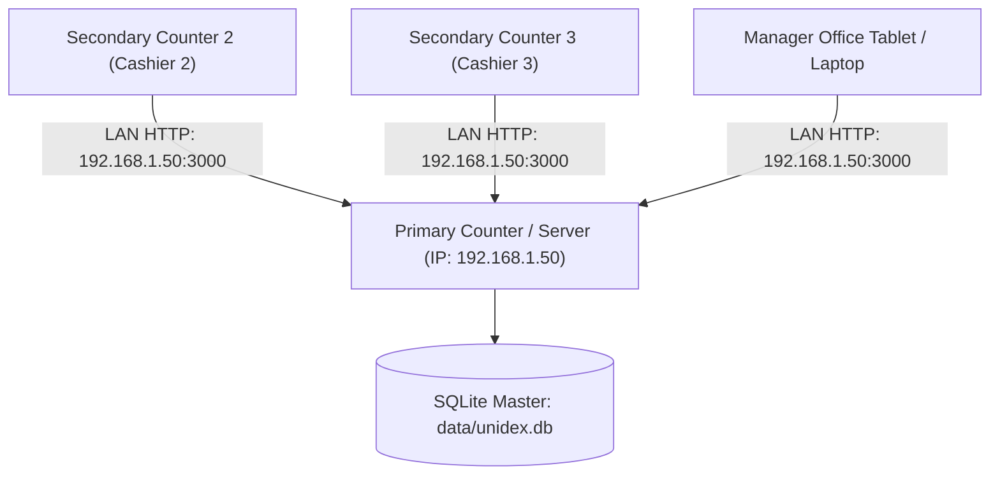
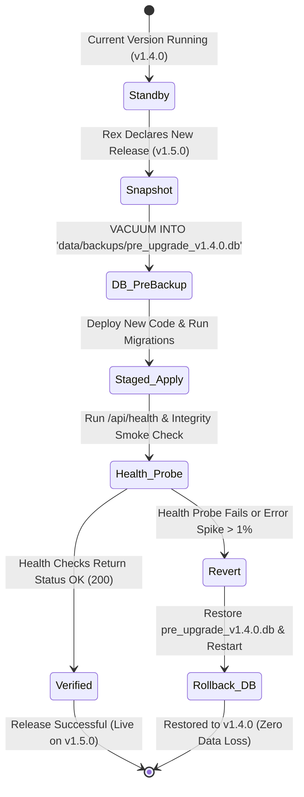

# 🛡️ Unidex ERP — DevOps & Site Reliability Engineering (SRE) Master Blueprint
**Document Owner:** Vikram (Senior DevOps & SRE)  
**Coordinated With:** Rex (Release Manager), Maya (Principal Security Engineer), Dev (Full-Stack Lead), Zara (Chief Architect)  
**System Target:** Unidex ERP v1.4.0+ (Node.js/Express + React 19 + TypeScript + SQLite WAL mode)  
**Last Updated:** October 05, 2026  

---

## Executive Summary & SRE Philosophy

Unidex ERP is a mission-critical billing engine powering retail checkouts across India. In physical retail, **downtime directly causes lost sales, stranded customers at the billing counter, and inventory discrepancies**.

Our DevOps & Site Reliability Engineering charter is built on four core tenets:
1. **Zero Unexpected Downtime:** POS billing must never fail due to background maintenance, checkpoint locks, or memory leaks.
2. **ACID-Compliant Zero-Data-Loss Backups:** SQLite WAL mode requires clean, atomic point-in-time snapshots using `VACUUM INTO` and proactive checkpoints—never raw, uncoordinated file copying.
3. **Frictionless Multi-Topology Deployments:** Seamless operation across a standalone Windows counter PC, multi-terminal LAN setup, or containerized cloud host.
4. **Deterministic Version Gates & Instant Rollback:** Every deployment is immutable, cryptographically verified, and backed by a 60-second instant rollback mechanism.

```
   ┌────────────────────────────────────────────────────────────────────────┐
   │                       UNIDEX ERP SRE TOPOLOGY                         │
   └────────────────────────────────────────────────────────────────────────┘
              │
              ├── [1] CI/CD Pipeline (GitHub Actions: Lint -> Test -> Build -> Tag)
              │
              ├── [2] Engine Resilience (WAL Checkpointing, VACUUM INTO, Integrity)
              │
              ├── [3] Deployment Tiers (Desktop BAT | Multi-Terminal LAN | Docker Hub)
              │
              └── [4] SRE Governance (Rex Release Handshake | Maya Security Hardening)
```

---

## 1. CI/CD Pipeline Blueprint

### 1.1 GitHub Actions Workflow Architecture (`.github/workflows/ci.yml`)
Every commit to `develop` or `main` and all pull requests must pass four automated quality and safety gates before merging or artifact creation:



#### Pipeline Gates Breakdown:
1. **Gate 1: Linting & Static Typing (`npm run lint` / `tsc --noEmit`)**
   - Validates 100% strict TypeScript types across client and backend.
   - Blocks implicit `any` regressions and broken import definitions.
2. **Gate 2: Database Engine & ACID Smoke Verification**
   - Executes automated headless verification of `node:sqlite` in WAL mode.
   - Validates `PRAGMA integrity_check;` and schema initializers on isolated in-memory/temp databases.
3. **Gate 3: Production Client Build (`npm run build`)**
   - Executes Vite rollup packaging with Tailwind v4 engine.
   - Verifies bundle sizes, asset hashing, and gzip compression budgets.
4. **Gate 4: Automated Release Packaging & Checksum Generation (Tagged Releases)**
   - Triggers on semantic git tags (`v*.*.*`).
   - Packages `dist/`, `server.ts`, `START_UNIDEX_ERP.bat`, `package.json`, and licensing documentation into `unidex-erp-release-vX.Y.Z.zip`.
   - Computes SHA-256 cryptographic hashes for supply-chain integrity verification.

---

## 2. Disaster Recovery & Automated SQLite Backup Strategy

### 2.1 The WAL Concurrency Risk & The Solution
In SQLite WAL (Write-Ahead Logging) mode, uncheckpointed write transactions reside in `unidex.db-wal`, while reader memory maps access `unidex.db-shm`. 

> [!CAUTION]
> **Naive File Copy Risk:** Running a naive `fs.copyFile` or direct file stream of `data/unidex.db` while active billing transactions occur can copy mismatched pages or omit pending WAL frames, creating a torn or corrupt database backup!

#### The Bulletproof SQLite Backup Pipeline:


1. **Passive WAL Checkpointing:** Execute `PRAGMA wal_checkpoint(PASSIVE)` prior to backup to merge flushed log frames into the main database without waiting for reader locks or interrupting POS billing.
2. **Atomic Hot Backup via `VACUUM INTO`:** SQLite 3.27+ native `VACUUM INTO 'filepath'` command generates an exact, defragmented, ACID-consistent clone of the database in the background without holding prolonged write locks.
3. **Immediate Post-Backup Corruption Verification:** Before sealing the backup file, the system runs `PRAGMA integrity_check` on the generated clone. If any corruption is detected, the snapshot is quarantined and an SRE alert is raised.
4. **Daily End-of-Day Truncation:** During daily cashier closeout or system restart, execute `PRAGMA wal_checkpoint(TRUNCATE)` to reset WAL size to 0 bytes and eliminate file bloat.

### 2.2 3-2-1 Enterprise Backup Rotation Protocol
For Indian retail environments, data loss must be prevented even in cases of hardware failure, disk crash, virus infection, or power surge:

| Tier | Destination | Frequency | Retention Schedule |
|---|---|---|---|
| **Tier 1: Live Storage** | `data/unidex.db` + WAL | Real-time ACID writes | Continuous operation |
| **Tier 2: Local Drive Archive** | `data/backups/unidex_backup_YYYYMMDD_HHMM.db` | Hourly checkpoint / Daily at EOD | Last 7 daily snapshots + 4 weekly snapshots |
| **Tier 3: Removable Media (USB)** | Auto-detected USB Drive (`E:\UnidexBackups\`) | Daily upon counter close | Last 14 daily snapshots |
| **Tier 4: Off-Site Cloud Mirror** | Encrypted S3 bucket / Google Drive / Remote Webhook | Nightly at 02:00 IST | 12 monthly immutable archives |

---

## 3. Environment & Deployment Models

Unidex ERP supports three distinct operational deployment topologies:

### Model A: Single-Counter Desktop (Standalone Retail Store)
*Ideal for single-till grocery stores, chemists, hardware stores, and apparel boutiques.*



- **Execution:** One-click execution via [START_UNIDEX_ERP.bat](file:///d:/New_ERP-main/START_UNIDEX_ERP.bat).
- **Resilience Enhancements:**
  - Port conflict autodetection: checks if port 3000 is occupied and kills stale orphan processes.
  - Health check polling: verifies `/api/health` responds before opening the browser window.
  - Windows Service integration (via WinSW/NSSM) for automatic background launch on terminal power-up without leaving open terminal windows.

### Model B: Multi-Terminal Local Area Network (Supermarket / Multi-Lane POS)
*Ideal for multi-counter supermarkets, departmental stores, and wholesale distributors.*



- **Architecture:** The master billing terminal runs the Node.js server and hosts `data/unidex.db`.
- **Host Binding:** Server listens on `0.0.0.0:3000` instead of `127.0.0.1`.
- **LAN Discovery & Zero-Config:** mDNS hostname advertisement (`http://unidex-server.local:3000`) so secondary counters connect seamlessly without needing fixed static IP addresses.
- **Firewall Provisioning:** 1-click firewall helper batch command:
  ```cmd
  netsh advfirewall firewall add rule name="Unidex ERP POS Port 3000" dir=in action=allow protocol=TCP localport=3000
  ```

### Model C: Containerized / Cloud Self-Hosting (Multi-Branch / Centralized Backoffice)
*Ideal for multi-branch store chains or merchant owners wanting remote ledger access.*

- **Containerization Blueprint:**
  - Multi-stage Dockerfile based on `node:22-alpine` for minimal attack surface (<150MB).
  - Isolated non-root execution (`USER node`).
  - Persistent volume mount on `/app/data` ensuring SQLite databases and audit logs survive container restarts.
  - Automated health check configured in Docker Compose (`curl -f http://localhost:3000/api/health || exit 1`).
  - Reverse proxy integration with Caddy or Nginx for automated Let's Encrypt SSL/TLS certificates.

---

## 4. Coordination Protocol with Rex & Maya

### 4.1 Zero-Downtime Releases & Instant Rollback Protocol (with Rex)
As Release Manager, Rex governs versioning and changelogs. DevOps guarantees operational safety during version upgrades.



#### Pre-Release Checklist:
1. **Pre-Flight Snapshot:** Prior to running any database migration, generate an immutable copy `data/backups/pre_upgrade_vX.Y.Z.db`.
2. **Forward/Backward Migration Hooks:** Every database schema alteration must have a companion `down` script.
3. **Automated Rollback Trigger:** If `/api/health` fails 3 consecutive checks or the server fails to bind within 60 seconds of updating, the launcher automatically rolls back to the previous stable release binary and reinstates the pre-flight database snapshot.

### 4.2 Security & Infrastructure Hardening Protocol (with Maya)
DevOps collaborates directly with Maya (Principal Security Engineer) to enforce zero-trust operational security:

1. **Zero-Plaintext Secrets in Version Control:**
   - Git repository ignores `.env`, `.env.local`, `data/*.db`, and `data/*.log`.
   - CI pipeline incorporates automated secret-scanning gates to block accidental leaks of API tokens or credentials.
2. **Least-Privilege File Permissions:**
   - In production deployments, `data/` directory permissions are locked down (`icacls data /inheritance:r /grant:r administrators:(OI)(CI)F /grant:r Users:(OI)(CI)M` on Windows; `chmod 700 data` on POSIX).
3. **Administrative Diagnostic Route Protection:**
   - Operational endpoints (`/api/admin/backup-db`, `/api/admin/reset-demo`, `/api/health/diagnostics`) require authenticated non-cashier authorization tokens.
4. **Immutable Audit Trail Integrity:**
   - `data/audit_trail.log` (MCA Section 134(5) compliance) is backed up in lockstep with `unidex.db`. Checksums are validated to guarantee tamper evidence.

---

## 5. Telemetry, Health & Liveness Probes

### 5.1 Enhanced `/api/health` & `/api/health/diagnostics` Specification
To support proactive SRE monitoring without performance overhead, the health endpoints provide clear operational diagnostics:

```json
{
  "status": "healthy",
  "version": "1.4.0",
  "uptime_seconds": 86420,
  "database": {
    "engine": "node:sqlite",
    "journal_mode": "wal",
    "integrity": "ok",
    "wal_checkpoint": {
      "busy": 0,
      "log_frames": 12,
      "checkpointed_frames": 12
    },
    "db_size_bytes": 1048576
  },
  "system": {
    "memory_rss_mb": 78.4,
    "heap_used_mb": 42.1,
    "node_version": "v22.14.0",
    "platform": "win32"
  }
}
```

### 5.2 Key Alerting Thresholds
- **WAL Log Bloat Alert:** Trigger warning if `log_frames - checkpointed_frames > 10,000` (indicates active long-running transaction blocking checkpoints).
- **Memory Alert:** Trigger warning if RSS exceeds 512 MB.
- **Disk Free Space Alert:** Prevent new checkout invoices if local disk space drops below 200 MB, alerting cashier before SQLite enters read-only disk-full state.

---

## Conclusion & Next Actions

Unidex ERP's operational architecture is primed for production stability. With GitHub Actions CI gating code quality, `VACUUM INTO` ensuring rock-solid backups, multi-topology networking ready for single or multi-counter retail, and rollback protocols aligned with Rex and Maya, Unidex ERP guarantees sub-second POS resilience across all merchant deployments.
