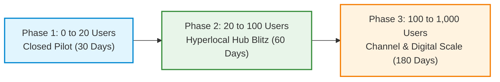
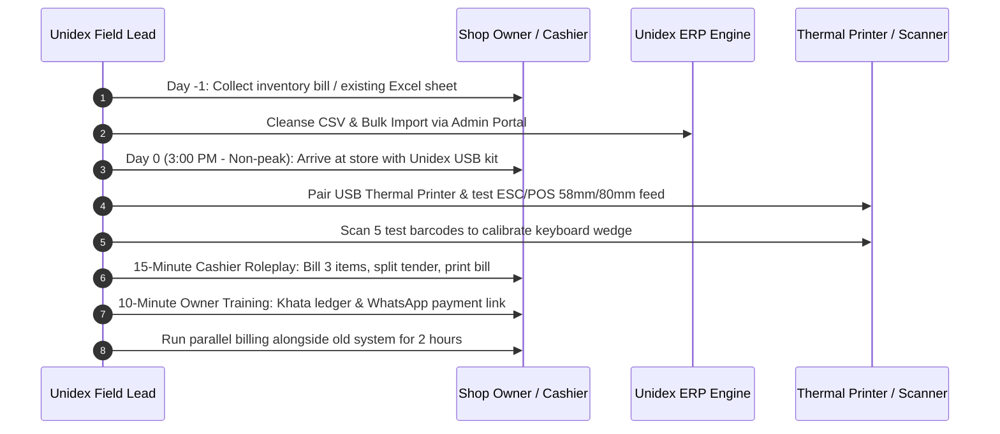
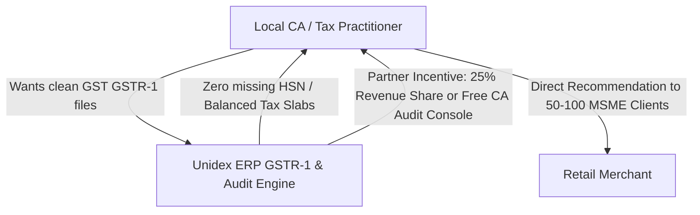

# UNIDEX ERP (v1.4.0) — GO-TO-MARKET (GTM) PRODUCT LAUNCH & VISIBILITY MASTERPLAN

**Document Version:** `v1.0.0-PROD`  
**Target Market:** Indian Micro, Small & Medium Retail Enterprises (MSME & Retail Trade)  
**Author:** Chief Marketing Officer & Head of Growth (GTM Lead)  
**Date:** October 05, 2026  
**Product Status:** Production-Ready (`v1.4.0` — Offline-First SQLite POS ERP, Dual-Entry Khata, UPI Reminders, GST Compliance)

---

## Executive Summary: The 0-to-1 Imperative

Unidex ERP v1.4.0 is an enterprise-grade, lightning-fast, offline-first Point-of-Sale (POS) and retail enterprise resource planning system built explicitly for Indian retail merchants. With Section 170 rounding, multi-slab GST calculation, Bahi-Khata ledgers, AR aging, WhatsApp payment links, thermal printing, and MCA audit compliance, **the product is technologically complete, but commercially at ground zero: 0 users, 0 beta feedback, and 0 market awareness.**

The purpose of this GTM Masterplan is to transition Unidex ERP from a local codebase into a cash-flow positive, merchant-beloved franchise across India's Tier-1, Tier-2, and Tier-3 commercial hubs.



---

## 1. Product Positioning & Value Proposition

### 1.1 The Competitive Landscape & Wedge Strategy
The Indian retail software market is dominated by four incumbent categories:
1. **Vyapar / myBillBook:** Mobile-first, cloud-reliant applications that suffer severe latency spikes on slow networks, lock critical data behind recurring SaaS paywalls, and crash under high SKU counts (>5,000 items).
2. **Marg ERP:** Legacy desktop software built on 1990s architectures; steep learning curve, cumbersome UI, fragile licensing dongles, and slow hardware integration.
3. **Tally Prime:** Accounting behemoth unsuitable for high-speed front-counter billing; requires dedicated accounting staff and lacks native thermal printer plug-and-play or instant WhatsApp khata settlement links.

### 1.2 Unidex ERP's Sharp Wedge Matrix

| Dimension | Legacy Desktop (Marg / Tally) | Mobile Cloud Apps (Vyapar / myBillBook) | Unidex ERP (v1.4.0) |
|---|---|---|---|
| **Billing Speed** | 15–30 sec per ticket; complex navigation | 10–20 sec; lags on slow 4G/5G connections | **< 3 seconds per invoice**; zero network latency |
| **Network Dependency** | Offline, but cumbersome backup | Cloud-dependent or sync-bottlenecked | **100% Offline-First SQLite**; zero cloud downtime |
| **Pricing Model** | High upfront cost (₹18,000+) + paid AMC | Recurring annual subscription tax (₹3,000–₹6,000/yr) | **Perpetual / Predictable Flat Fee**; zero recurring cloud tax |
| **Data Privacy & Control** | Local file, but prone to corruption | Merchant sales data stored on 3rd-party servers | **Self-Sovereign Data**; merchant owns raw database |
| **Hardware Compatibility** | Requires manual COM/LPT port setup | Bluetooth printer pairing frequently disconnects | **USB/Raw ESC/POS Thermal + Barcode Plug & Play** |
| **Credit Recovery** | Manual ledger tracking | SMS-based payment reminders (low open rate) | **Interactive Khata + 1-Click WhatsApp NPCI UPI Link** |

### 1.3 Core Positioning Statements
- **For High-Footfall Retailers (Kirana, FMCG, Supermarket):** *"Never let a customer wait in line. 3-second billing that never stops, even when the internet is dead."*
- **For Trade & Hardware Stores (Electrical, Sanitary, Paints):** *"Your complete Bahi-Khata ledger with instant WhatsApp UPI payment links. Collect your credit 3x faster without leaving your counter."*
- **For Shop Owners Concerned About Data Security:** *"Your shop's accounts belong to you, not a cloud server. 100% offline, zero data tracking, zero annual cloud extortion."*

---

## 2. The 0-to-1 Closed Beta Pilot Strategy (The First 20 Merchants)

The goal of the Closed Beta is not broad distribution; it is **hyper-intense validation of daily counter usage, zero-crash reliability, and cashier happiness.**

### 2.1 Target Merchant Cohorts
We target three distinct store categories within a single compact 5 km commercial radius (e.g., Sadar Bazar / Gandhi Nagar / Indiranagar / T. Nagar):

```
Cohort A: High-Velocity FMCG / Superettes (8 Stores)
├── Daily Invoices: 150 – 400
├── Peak Hours: 8:00 AM - 11:00 AM & 6:00 PM - 10:00 PM
├── Key Validation: Barcode scanner ergonomics, Section 170 round-off, thermal receipt speed.

Cohort B: Electrical, Hardware & Sanitary Ware (7 Stores)
├── Daily Invoices: 30 – 80 (High average order value: ₹1,500 – ₹25,000)
├── Credit Ratio: 60%+ sales on Udhaar (Credit)
├── Key Validation: Bahi-Khata ledger accuracy, AR Aging, WhatsApp UPI payment links.

Cohort C: Mobile & Electronics Accessories / Stationery (5 Stores)
├── Daily Invoices: 50 – 120
├── SKU Complexity: 2,000 – 6,000 items with warranties and serials
├── Key Validation: Bulk CSV catalog import, cashier margin hiding, fast search.
```

### 2.2 The "White-Glove Setup" Onboarding Playbook
Merchant adoption dies at data migration and hardware frustration. We eliminate both via an in-person, 60-minute turnkey deployment:



#### Step-by-Step White-Glove SLA:
1. **Catalog Migration (30 mins):** Take their existing supplier invoices or legacy software export, run our CSV sanitizer, verify zero formula injections, and ingest via `/api/products/bulk`.
2. **Hardware Calibration (15 mins):** Connect USB thermal receipt printer (TVS RP-3160, Pegasus, or Epson compatible) and test ESC/POS cuts, headers, and GST tax summary formatting.
3. **Cashier Speed Run (15 mins):** Train cashier on hotkeys (`F2` new sale, `Enter` to tender, `Esc` to void), barcode scanner focus, and split tender (Cash + UPI).
4. **Owner Handshake (10 mins):** Show the owner the Admin Khata Passbook on their laptop and send an actual test WhatsApp payment link to their personal phone.

### 2.3 Pilot SLAs & Support Framework
- **Zero-Downtime Guarantee:** Dedicated WhatsApp VIP Support Group `[Store Name] <> Unidex Founders` with an **under-3-minute response time** during store operating hours (8:00 AM – 10:30 PM).
- **Daily End-of-Day (EOD) Touchpoint:** 5-minute phone call at 9:30 PM:
  - Did the cash drawer balance match?
  - Did any thermal print freeze?
  - How many WhatsApp reminders were sent?

### 2.4 Pilot Success Metrics & Exit Gates

| Metric | Target Gate | Verification Method |
|---|---|---|
| **Daily Active Billing (DAB)** | 100% of store sales processed through Unidex for 14 consecutive days | SQLite `sales` table timestamps & invoice sequence |
| **Counter Billing Latency** | ≤ 3.5 seconds per checkout ticket | On-site stopwatch audit during peak footfall |
| **Khata Collection Impact** | ≥ 25% reduction in AR overdue days (>30 days bucket) | Khata Aging Ledger report before vs. after |
| **Cashier Retention Score** | Net Promoter Score (NPS) ≥ 9/10 ("Would you cry if we took it away?") | 1-on-1 Cashier exit survey |
| **Unsolicited Referrals** | At least 5 of the 20 merchants introduce an adjacent shop owner | Referral log tracker |

---

## 3. Distribution Channels & Hyperlocal Visibility Playbook

### 3.1 Feet-on-Street (FOS) / Local Market Blitz
Indian MSME retail software is sold in person, not through Google search ads. Trust is local and visual.

```
Market Cluster Blitz Campaign (e.g., Electronics & Hardware Lane):
├── Target: 50 stores in a continuous 500-meter commercial street.
├── The "5-Minute Billing Challenge":
│   ├── Sales Rep walks in with a ruggedized tablet/laptop + portable 58mm printer.
│   ├── Challenge: "Bhaiya, give me your 3 hardest items. If I cannot create a GST bill
│   │   and print it on this slip in under 5 seconds, I will buy 10 cold drinks from you."
│   └── 90% conversion to a full in-store demo.
└── Visual Dominance:
    ├── Distribute free counter-top Unidex branded acrylic QR code stands with merchant's UPI.
    ├── High-durability vinyl keyboard shortcut stickers placed right on cash counter screens.
```

### 3.2 The "CA & Tax Practitioner" Referral Engine
Chartered Accountants (CAs) and Tax Consultants (GST Suvidha Providers) are the ultimate trusted advisors to MSME merchants. If an accountant recommends software, the merchant buys it.



#### The CA Value Proposition:
- **Pain Point:** CAs waste hundreds of hours every month fixing scrambled Excel sheets, missing HSN codes, and mismatched GST rates from kiranas.
- **Unidex Fix:** Unidex guarantees Section 170 mathematical precision, compliant MCA audit logs, and 1-click GSTR-1 clean export.
- **CA Partner Program:**
  - Free "Unidex Practice Suite" for the CA firm to view client ledgers.
  - ₹1,000 referral fee per onboarded merchant OR ₹2,500 billing credit.
  - Quarterly "GST Compliance Excellence" co-branded workshops for local Vyapar Mandal (Traders Association).

### 3.3 Hardware Partner Bundles (The "Turnkey POS Box")
Merchants dread buying software and hardware separately because when a printer stops working, software vendors blame hardware vendors.

```
The Unidex "Dukaan Pro" Turnkey Bundle:
├── Hardware Component 1: 3-inch (80mm) Heavy-Duty Thermal Receipt Printer (Auto-cutter)
├── Hardware Component 2: 2D Omnidirectional USB Desktop Barcode Scanner
├── Software Component: Unidex ERP v1.4.0 Pre-installed on USB / Plug-and-Play Installer
├── Packaging: Premium branded box: "Unidex Dukaan Pro — Open, Plug In, Start Billing"
├── Channel Margin:
│   ├── Wholesale Hardware Cost: ₹4,800
│   ├── Unidex License: ₹3,999
│   ├── Retail Bundle Price: ₹9,999 (Perceived Value: ₹15,000+)
│   └── Hardware Vendor Kickback: ₹1,200 per bundle sold
```

### 3.4 Digital Presence & Regional Content Playbook
- **YouTube Regional Billing Tutorials:**
  - Target Keywords: *"Vyapar alternative offline"*, *"Kirana dukan me barcode billing kaise kare"*, *"GST bill print 3 inch thermal printer"*.
  - Language Mix: 60% Hindi, 20% Tamil, 20% Telugu/Kannada.
  - Format: Screen recording showing raw hands on keyboard and printer spitting out receipts within 2 seconds.
- **WhatsApp Trader Community Growth:**
  - Launch *"Vypari Mitra"* community offering daily free business tips, GST slab change alerts, and tax calendar reminders.
  - Share short 15-second screen clips showcasing the 1-click WhatsApp payment link with dynamic UPI.

### 3.5 Competitor Conquesting Campaign

```
Campaign: "Stop Paying the Cloud Tax"
Target: Disgruntled Vyapar & myBillBook users facing subscription renewals.
├── Headline: "Why pay ₹4,999 EVERY YEAR just to make a bill in your own shop?"
├── Comparison Ad:
│   ├── Their App: Internet goes down -> Billing stops -> Customer walks away.
│   └── Unidex: Internet goes down -> Lightning fast billing continues -> Zero loss.
└── Migration Guarantee:
    └── "Send us your old software backup file; our engineers will migrate your entire
        stock and khata ledger within 2 hours, free of charge."
```

---

## 4. Phased Launch Roadmap & Milestone Gateways

```mermaid
flowchart TD
    subgraph Phase 1: 0 to 20 Users (Days 1 - 30)
        P1A["Handpick 20 Friendly Merchants"] --> P1B["White-glove In-Person Deployment"]
        P1B --> P1C["Zero-Crash Hardening & Feature Polish"]
    end
    subgraph Phase 2: 20 to 100 Users (Days 31 - 90)
        P2A["Launch CA Partner Network in 2 Cities"] --> P2B["FOS Merchant Blitz (3 Commercial Markets)"]
        P2B --> P2C["Hardware Bundling with Local POS Distributors"]
    end
    subgraph Phase 3: 100 to 1000 Users (Days 91 - 270)
        P3A["Self-Serve Web Installer & Digital Ads"] --> P3B["Regional Channel Reseller Distribution"]
        P3B --> P3C["Multi-Store & Cloud Sync Expansion"]
    end
    Phase 1 --> Phase 2
    Phase 2 --> Phase 3
```

### Phase 1: Closed Friendly Beta (0 to 20 Users — Days 1 to 30)
- **Primary Objective:** Flawless stability, zero data corruption, zero lost tickets, and positive cashier sentiment.
- **Geography:** Single city cluster within 15 km of founding team (e.g., Delhi NCR / Bengaluru / Pune).
- **Pricing:** 100% Free Lifetime Pilot License in exchange for daily operational feedback and a video testimonial.
- **Exit Gate to Phase 2:**
  - 15 out of 20 merchants actively billing daily for >14 consecutive days.
  - Over 5,000 real customer receipts printed without a single database rollback error.
  - At least 3 unprompted referrals from pilot merchants.

### Phase 2: Hyperlocal Regional Expansion (20 to 100 Users — Days 31 to 90)
- **Primary Objective:** Prove repeatable unit economics and channel distribution.
- **Geography:** Expand to 3 concentrated commercial clusters (e.g., Surat, Jaipur, Indore).
- **Execution:**
  - Deploy 2 dedicated Feet-on-Street (FOS) sales engineers.
  - Sign up 10 CA firms as certified referral partners.
  - Partner with 3 regional POS hardware distributors.
- **Pricing:** Commercial introduction: ₹3,999 one-time license or ₹1,499/year with hardware bundle option.
- **Exit Gate to Phase 3:**
  - 85+ active stores billing weekly.
  - Blended Customer Acquisition Cost (CAC) under ₹1,200 per merchant.
  - Payback period under 30 days.

### Phase 3: Commercial General Availability & Scale (100 to 1,000 Users — Days 91 to 270)
- **Primary Objective:** Rapid market visibility, regional channel dominance, and self-serve flywheel.
- **Execution:**
  - Launch self-serve web installer with 14-day zero-risk trial.
  - Roll out tier-2 reseller margins (35% commission to local IT/computer repair shops).
  - Launch digital conquest ad campaigns across Meta, YouTube, and Google Search.
  - Launch add-on monetization: Multi-device sync, SMS gateway pack, advanced analytics.

---

## 5. Metrics, Unit Economics & Funnel Optimization

### 5.1 Unit Economics Target (Per Merchant)

| Metric | Target Value | Strategic Rationale |
|---|---|---|
| **Average Revenue Per User (ARPU)** | ₹4,999 (Upfront + Hardware margin) | Attractive entry point for MSMEs vs. high legacy upfronts |
| **Customer Acquisition Cost (CAC)** | ₹1,450 (Blended FOS + Channel) | Scalable through CA and reseller referral leverage |
| **Gross Margin** | 82% (Software + Box margin) | High operating leverage of local SQLite architecture |
| **LTV / CAC Ratio** | 4.8x | Exceptional capital efficiency driven by near-zero cloud server costs |
| **Monthly Churn Rate** | < 1.2% | Once a POS is integrated with cash drawers and inventory, switching costs are high |

### 5.2 North Star Metric & Conversion Funnel
- **North Star Metric:** **Weekly Active Billed Receipts (WABR)** — Measures real utility and counter stickiness.
- **Conversion Funnel Targets:**
  - Lead / Shop Visit $\rightarrow$ Live 5-Minute Demo: **65%**
  - Live Demo $\rightarrow$ 7-Day Pilot Installation: **40%**
  - Pilot Installation $\rightarrow$ Paying Customer / Retained Store: **80%**

---

## 6. Immediate Tactical Execution (Sprint Week 1 Checklist)

To secure the first 5 pilot merchants this week, the team must execute the following action items immediately:

```
[ ] 1. Pilot Collateral Preparation (Day 1 - 2):
    ├── Print 50 high-finish "Dukaan Quick-Start Guides" (1-page laminated hotkey cheat-sheet).
    ├── Prepare 5 "Unidex Pilot Kits" on bootable USB drives with pre-loaded demo catalogs.
    └── Assemble 2 TVS/Pegasus USB thermal receipt printers + 1D/2D handheld scanners for demos.

[ ] 2. Pilot Merchant Selection & Outreach (Day 2 - 3):
    ├── Identify 10 neighborhood Kirana & Hardware shops within 3 km of the office.
    ├── Secure commitments from 3 friendly merchants for a 1-hour live counter test.
    └── Pre-clean their inventory CSV using our formula-sanitized bulk import tool.

[ ] 3. The First In-Store Deployment (Day 4):
    ├── Conduct live deployment at Pilot Merchant #1 at 2:30 PM (afternoon lull).
    ├── Complete white-glove thermal printer pairing and cashier training in under 45 minutes.
    └── Observe evening peak hour billing (6:00 PM - 8:30 PM); resolve any UI friction on the spot.

[ ] 4. Feedback & Hardening Loop (Day 5 - 7):
    ├── Collect daily cash drawer reconciliation and AR ledger logs.
    ├── Generate Merchant Testimonial Video #1 (Cashier smiling, holding 3-sec printed receipt).
    └── Pitch adjacent shop owner using the first merchant as social proof.
```

---

## 7. Conclusion: The Path to Market Leadership

Unidex ERP possesses the exact architectural advantages Indian retail merchants are crying out for: **instantaneous speed, offline autonomy, zero cloud subscriptions, and airtight GST and Khata compliance.**

By executing this rigorous, hyperlocal, white-glove pilot strategy, Unidex will establish an unshakeable base of 20 fanatical merchants, unlock the powerful CA referral channel, and scale predictably across India's high-density retail corridors.
