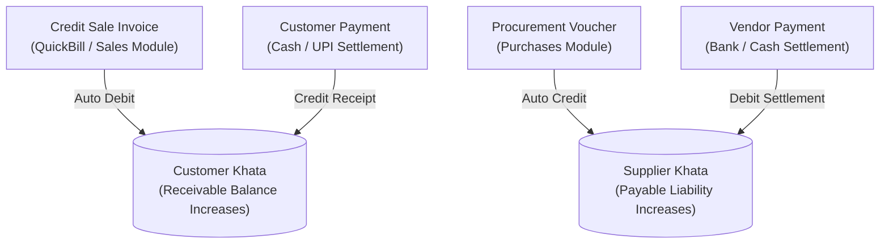

# Unidex ERP — Merchant Operations & Khata Administration Guide
**Document Version:** 1.4.0 (Commercial Ledgers, Credit Aging & Bulk Operations)  
**Target Audience:** Store Owners, Retail Merchants, Head Cashiers, Accountants  
**Scope:** Customer & Supplier Khata, Payment Settlements, Credit Aging, WhatsApp UPI Reminders, CSV Catalog Bulk Import

---

## 1. Customer & Supplier Khata (Digital Passbook)

Traditional paper bahi-khata ledgers and manual notebooks are error-prone and vulnerable to lost credits. Unidex ERP includes a **digital double-entry Khata engine** linked directly to POS sales vouchers and vendor purchase orders.



### 1.1 Accessing the Khata Passbook
Store operators can open an account passbook in three ways:
1. **From Admin Module:** Go to **Admin > Khata & Aging** tab. Find any customer or vendor and click **View Khata**.
2. **From Sales Module:** Go to **Sales > Parties** and click on any customer card.
3. **From Purchases Module:** Click on any vendor to review outstanding payables.

### 1.2 Reading the Passbook Ledger
The Khata Passbook displays an audit-compliant, chronological list of transactions:
- **Date & Time:** Exact timestamp when the invoice or payment was processed.
- **Reference / Invoice No:** Clickable document link (e.g., `INV/2026-27/00015` or `PAY-1718012345`).
- **Debit (₹):** 
  - For Customers: Invoices billed on credit (increases what customer owes you).
  - For Suppliers: Payments made by your store to settle invoices.
- **Credit (₹):**
  - For Customers: Payments received from the customer (reduces outstanding balance).
  - For Suppliers: Incoming goods shipments (increases what you owe the vendor).
- **Running Balance (₹):** Real-time net account balance calculated after every transaction.

---

## 2. Recording Settlement Payments (Cash / UPI / Bank)

When a customer comes to the counter to clear their balance, or when your store pays a vendor:

### Step-by-Step Payment Recording:
1. Open the party's ledger passbook via **View Khata**.
2. Click the blue **Record Payment** button in the header.
3. In the settlement dialog:
   - **Amount:** The modal automatically pre-fills the total pending balance. Modify the amount if the party is making a partial settlement.
   - **Payment Mode:** Select **Cash**, **UPI**, **Bank Transfer**, or **Cheque**.
   - **Reference / Notes (Optional):** Enter transaction UTR number, UPI reference, or cheque number (e.g., `PhonePe Txn 283910`).
4. Click **Confirm Settlement**.
5. **System Updates Executed Atomically:**
   - The party's balance is updated immediately.
   - A balancing credit/debit record is inserted into `ledger_entries`.
   - An entry is logged in the MCA audit trail under `ACTION: PAYMENT`.

---

## 3. Receivables Credit Aging & WhatsApp Payment Reminders

Unattended customer credit drains retail working capital. Unidex ERP features an automated **Receivables Aging Engine** that monitors debt vintage and enables 1-click WhatsApp payment collections with dynamic Bharat UPI payment links.

### 3.1 Credit Aging Buckets
Located in **Admin > Khata & Aging**, the dashboard categorizes customer receivables into three risk zones:

| Aging Bucket | Overdue Period | Risk Level | Merchant Action |
| :--- | :--- | :--- | :--- |
| **Current (0 - 30 Days)** | Within 30 days of sale | Healthy Credit | Normal commercial payment term; monitor silently. |
| **Overdue (31 - 60 Days)** | 31 to 60 days | Moderate Risk | Send a friendly 1-click WhatsApp payment reminder. |
| **Critical (> 60 Days)** | Over 60 days | Severe Default Risk | Flag customer account; pause counter credit; call for settlement. |

### 3.2 1-Click WhatsApp Payment Reminders with Dynamic UPI

Store operators can send automated, personalized payment reminders without typing customer messages manually:

1. In **Admin > Khata & Aging**, find any customer with an overdue balance.
2. Click **View Khata** to open their passbook.
3. If the balance is positive (`balance > 0`) and a phone number is registered, click the green **WhatsApp Reminder** button.
4. Unidex ERP automatically opens WhatsApp Web / WhatsApp Desktop pre-filled with the merchant's business name, exact pending balance, and a **clickable Bharat UPI payment link**:

```text
Hello Rajesh Sharma,
This is a friendly payment reminder from Unidex ERP. Your pending balance is ₹4,250.

You can pay quickly using this UPI link:
upi://pay?pa=store@okhdfcbank&pn=Unidex%20ERP&am=4250&cu=INR

Thank you for your business!
```

5. When the customer taps the link on their smartphone, their default payment app (Google Pay, PhonePe, Paytm, or BHIM) opens with your store's VPA and the exact outstanding amount pre-filled.

---

## 4. Bulk Catalog Operations via CSV

Store operators migrating from Tally, Vyapar, Marg, or Excel spreadsheets can upload thousands of products in seconds using the atomic CSV import tool.

### 4.1 Exporting the Active Catalog
1. Navigate to the **Inventory Stock** screen.
2. Click **Export (CSV)** in the top action bar.
3. The server generates an RFC 4180-compliant CSV spreadsheet containing all SKUs, barcodes, HSN codes, GST rates, stock levels, and prices.
4. *Security Guard:* If an operator logged in as a **Cashier** clicks Export, wholesale supplier cost columns (`costPrice`, `lastVendor`, `lastPurchasePrice`) are excluded automatically.

### 4.2 Bulk Import via CSV (Step-by-Step)
1. In the **Inventory Stock** screen, click **Bulk Import** (accessible to Admins & Accountants).
2. In the modal, click **Download CSV Template** to review the column schema.
3. Prepare your spreadsheet matching the required columns:

| Column Name | Type | Mandatory? | Sample Value | Validation Rules |
| :--- | :--- | :---: | :--- | :--- |
| `name` | String | **Yes** | `"Samsung 25W Charger"` | Product display name cannot be blank. |
| `barcode` | String | No | `"8901234567800"` | EAN-13, UPC, or custom item code. |
| `hsnCode` | String | No | `"8504"` | 4-8 digit HSN/SAC code for GST. |
| `gstRate` | Number | No | `18` | Standard slab (`0`, `5`, `12`, `18`, `28`). Defaults to `18`. |
| `costPrice` | Number | No | `450` | Wholesale purchase rate. Must be `<= sellPrice`. |
| `sellPrice` | Number | **Yes** | `999` | Retail selling price before tax. Must be `> 0`. |
| `mrp` | Number | No | `1299` | Maximum Retail Price. Defaults to `sellPrice` if blank. |
| `stock` | Number | No | `25` | Opening on-hand quantity. |
| `category` | String | No | `"Electronics"` | Department tag. Defaults to `'General'`. |

### 4.3 Validation & Price Sanity Safeguards
Before committing rows to the database, the Unidex validation engine inspects every row:
- **Zero Loss Alert:** Any item where `costPrice > sellPrice` is flagged with `Cost > Sell Price` to prevent selling at a loss.
- **Selling Price Guard:** Rows with missing or non-positive selling prices (`sellPrice <= 0`) are flagged.
- **Atomic Commits:** Valid rows are committed in a single ACID SQLite transaction (`POST /api/products/bulk`).
- **Interactive Error Preview:** If any rows have errors, the modal displays the row number and the exact failure reason before ingestion.
