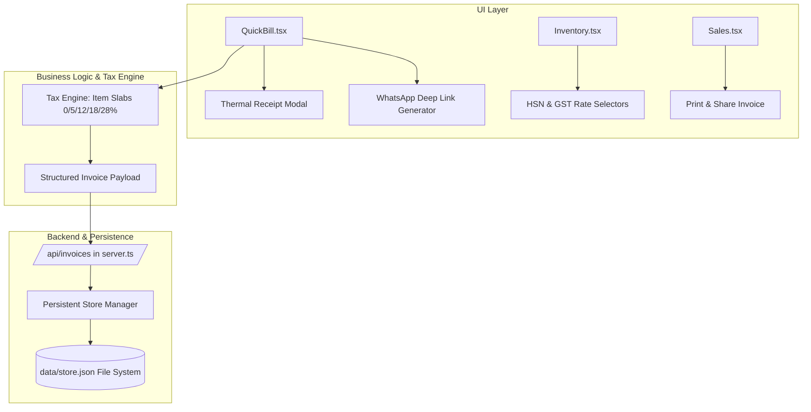

# Product Requirement Document (PRD): Sprint 1 — Core Retail & Compliance Engine
**Product:** Unidex ERP  
**Version:** 1.1.0 (Sprint 1)  
**Author:** Chief Product Officer / Lead PM  
**Target Release:** Immediate Sprint Execution  
**Status:** Approved for Engineering Implementation  

---

## 1. Executive Summary & Problem Statement

Retailers and MSME traders cannot adopt Unidex ERP in daily live production without three core pillars:
1. **Receipt & Sharing Capability:** Cashiers cannot hand paper receipts to walk-in customers or send digital bills to customers' phones via WhatsApp.
2. **Tax Compliance Accuracy:** Products across groceries, apparel, and electronics are taxed at 0%, 5%, 12%, 18%, or 28%. The existing hardcoded 18% GST violates Indian GST laws and distorts accounting.
3. **Data Durability:** Storing transactions and stock strictly in memory resets the store whenever the server restarts, leading to catastrophic data loss.

Sprint 1 delivers the foundational production engine: **Thermal Printing & WhatsApp Sharing**, **Granular GST Tax Slabs with HSN**, and **Persistent Storage**.

---

## 2. Target Personas & Core User Journeys

| Persona | Role | Primary Goal in Sprint 1 |
| :--- | :--- | :--- |
| **Rajesh (Store Owner / Retailer)** | Manages 1,000+ SKUs across multiple categories (0% food grains, 18% electronics). | Ensure stock data persists after server restarts, and invoices have compliant tax breakdowns. |
| **Amit (POS Cashier)** | Bills walk-in customers at peak hours. | Checkout under 5 seconds, print an 80mm/58mm thermal slip or click 1 button to send bill on WhatsApp. |
| **Pooja (Walk-in Customer)** | Buys goods at counter. | Receives an instant WhatsApp bill or printed thermal receipt with clean GST breakdown. |

---

## 3. Detailed Scope & Feature Specifications

### Feature A: 80mm/58mm Thermal Receipt Printing & 1-Click WhatsApp Invoice Sharing

#### Functional Requirements:
1. **Thermal Print Dialog / Template:**
   - Standard 80mm (and switchable 58mm) receipt format with monospace styling.
   - Elements included:
     - Store Header: Business Name, Address, Phone, GSTIN.
     - Invoice Metadata: Invoice Number, Date, Time, Cashier / Customer Name.
     - Itemized Table: Name, Qty, Rate, Tax %, Amount.
     - Summary: Subtotal, CGST / SGST (or IGST), Total Amount, Payment Method (Cash/UPI).
     - Store Footer: "Thank you for shopping with us!" + Custom UPI QR code / greeting.
   - Implementation: Trigger native `window.print()` targeting a clean `@media print` thermal-styled container or printable iframe.
2. **1-Click WhatsApp Bill Share:**
   - On checkout completion, display a prominent **"Share via WhatsApp"** action.
   - If customer phone number is provided, generate a formatted WhatsApp URL:
     `https://wa.me/91{phone}?text={encoded_message}`
   - The message contains:
     ```text
     🧾 *INVOICE FROM {STORE_NAME}*
     Invoice: #{INVOICE_ID}
     Date: {DATE}
     Customer: {CUSTOMER_NAME}
     --------------------------------
     {ITEM_LIST_WITH_QTY_AND_PRICES}
     --------------------------------
     Subtotal: ₹{SUBTOTAL}
     GST Total: ₹{TAX}
     *Grand Total: ₹{TOTAL}*
     Paid Via: {PAYMENT_METHOD}

     Thank you for your business!
     ```
   - Provide an optional quick input if customer phone was not captured before clicking checkout.

#### Acceptance Criteria (AC):
- **AC-A1:** Pressing "Print Receipt" prints in 80mm format without clipping, margin overflows, or header/footer browser artifacts.
- **AC-A2:** Clicking "Send via WhatsApp" opens WhatsApp Web / WhatsApp Mobile with pre-filled message text including full itemized breakdown and invoice ID.
- **AC-A3:** Available in both `QuickBill.tsx` checkout modal and in `Sales.tsx` when viewing historical invoices.

---

### Feature B: Granular GST Tax Slabs (0%, 5%, 12%, 18%, 28%) & HSN/SAC Engine

#### Functional Requirements:
1. **Product Master Data Enhancement (`Inventory.tsx` & Data Model):**
   - New fields on product entity:
     - `hsnCode`: string (e.g., "8517", "8471").
     - `gstRate`: number enum (`0`, `5`, `12`, `18`, `28`). Default to `18`.
     - `cessRate`: number (optional, default `0`).
2. **Cart & POS Tax Calculation Engine (`QuickBill.tsx` & `Sales.tsx`):**
   - Replace fixed `subtotal * 1.18`.
   - Calculate item-level tax:
     `itemTax = (item.price * item.qty) * (item.gstRate / 100)`
   - Aggregate tax by slab in cart summary:
     - e.g., GST 0%: ₹0, GST 5%: ₹25, GST 18%: ₹180.
   - State tax split:
     - Intra-state: CGST (`tax / 2`) + SGST (`tax / 2`).
     - Inter-state: IGST (`tax`).
3. **Backend API Validation (`server.ts`):**
   - `/api/invoices` validates and stores:
     - `items` array with each item's `hsnCode`, `gstRate`, `price`, `qty`, `taxAmount`.
     - `taxBreakup`: Record/Map of `{ "0": amount, "5": amount, "12": amount, "18": amount, "28": amount }`.
     - `subtotal`, `taxTotal`, `total`.

#### Acceptance Criteria (AC):
- **AC-B1:** Adding an item with 5% GST and an item with 18% GST calculates accurate combined taxes instead of flat 18%.
- **AC-B2:** Inventory creation/edit form has required HSN code and GST Rate dropdown (`0% Excluded`, `5%`, `12%`, `18%`, `28%`).
- **AC-B3:** Invoices stored in backend contain the item-wise tax rates and summary tax breakup.

---

### Feature C: Persistent Storage Layer in `server.ts`

#### Functional Requirements:
1. **File-Backed Persistent Store:**
   - Implement persistent file storage in `data/store.json` (or SQLite / local JSON database with atomic writes).
   - Entities persisted:
     - `products`: Array of products.
     - `transactions` / `invoices`: Array of invoices.
     - `purchases`: Array of purchase logs.
     - `parties`: Array of customers and vendors.
     - `settings`: Company profile and defaults.
2. **Atomic Reads & Writes:**
   - On server startup: Load data from `data/store.json`. If file does not exist, seed with default mock dataset.
   - On write operations (POST/PUT/DELETE): Update memory state and flush to disk synchronously/safely using `fs.promises.writeFile` with atomic temporary write or debounced save.
3. **Zero Frontend Regression:**
   - All existing REST API contracts (`/api/products`, `/api/invoices`, `/api/purchases`, `/api/parties`, `/api/settings`) maintain full backward compatibility.

#### Acceptance Criteria (AC):
- **AC-C1:** When the user creates 5 products, completes an invoice, and the server process is killed and restarted (`npm run dev`), all products and invoices remain completely intact.
- **AC-C2:** If `data/store.json` is missing on fresh installation, the server creates it automatically and seeds it without error.
- **AC-C3:** Concurrent writes do not corrupt the store file.

---

## 4. Technical Architecture & Component Changes



---

## 5. Non-Functional Requirements & Performance KPIs
- **POS Billing Latency:** Thermal receipt ready in `< 100ms` after clicking checkout.
- **Data Durability:** 100% survival across server crashes or reboots.
- **Tax Accuracy:** Zero decimal rounding error (strictly rounded to 2 decimal places using `Math.round(val * 100) / 100`).
