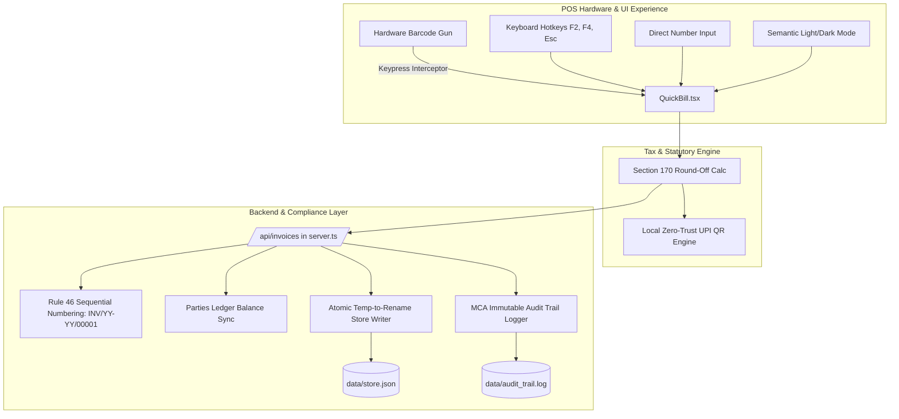

# Product Requirement Document (PRD): Sprint 1.1 — Statutory Compliance & POS Ergonomic Excellence
**Product:** Unidex ERP  
**Version:** 1.1.1 (Compliance & Ergonomics Hardening)  
**Author:** Chief Product Officer / Lead PM  
**Target Release:** Immediate Execution  
**Status:** Approved for Engineering Implementation  

---

## 1. Executive Summary & Strategic Rationale

Following our core engine release, this cycle directly addresses **Mandatory Indian Statutory Compliance** and **POS Operational Ergonomics**. Rather than adding speculative new modules, we harden our existing workflows to meet legal standards (CGST Rules, MCA audit requirements, data privacy) and achieve true retail counter speed (<3 second checkouts with hardware scanners and zero mouse usage).

---

## 2. Scope Breakdown: Statutory Compliance & Feature Improvements

### Pillar 1: Mandatory Statutory Compliance

#### 1.1 Section 170 CGST Act Round-Off Rule
- **Problem:** Decimal tax splits (e.g., ₹1,142.67) lead to cash reconciliation headaches and non-compliance with Section 170.
- **Specification:**
  - Round final invoice amounts to the nearest whole rupee:
    - Fractions >= ₹0.50 round UP to ₹1.00 (e.g., +₹0.33).
    - Fractions < ₹0.50 round DOWN (e.g., -₹0.42).
  - Explicitly track and display the `roundOff` delta on the invoice summary, thermal print receipt, and backend transaction object.
  - Formula:
    $$\text{ExactTotal} = \text{Subtotal} + \text{TaxTotal}$$
    $$\text{FinalPayable} = \text{Math.round}(\text{ExactTotal})$$
    $$\text{RoundOff} = \text{Math.round}((\text{FinalPayable} - \text{ExactTotal}) \times 100) / 100$$
- **Acceptance Criteria:**
  - Thermal receipt, WhatsApp message, and database record show: `Subtotal`, `Tax Total`, `Round Off (+/- ₹X.XX)`, and `Net Payable (₹Whole)`.

#### 1.2 CGST Rule 46 Sequential Invoice Numbering with Financial Year Sequence
- **Problem:** Random timestamp IDs (e.g. `INV-1718293847291`) violate Rule 46 of CGST Rules, 2017, which mandates consecutive serial numbers not exceeding 16 characters unique for each Financial Year.
- **Specification:**
  - Standard format: `INV/YY-YY/00001` (e.g., `INV/26-27/00001` or `INV/2026-27/00001`).
  - Store a persistent sequence counter per financial year in `data/store.json`.
  - Atomically increment with zero collision risk.
  - Reset / transition sequence when financial year changes (1st April).
- **Acceptance Criteria:**
  - New invoices strictly follow sequential numbering.
  - Timestamp IDs removed from production invoice numbers.

#### 1.3 MCA (Ministry of Corporate Affairs) Immutable Audit Trail
- **Problem:** Indian company law mandates that accounting software must have an unalterable audit trail recording every edit, creation, and deletion with user/timestamp.
- **Specification:**
  - Append-only audit log stored in `data/audit_trail.log` or within `store.json`.
  - Captures: `timestamp`, `action` (CREATE_INVOICE, UPDATE_PRODUCT, DELETE_PRODUCT, UPDATE_SETTINGS), `entityId`, `oldValue`, `newValue`, and `ipOrUser`.
  - No API endpoint shall allow editing or deleting records from the audit log.
- **Acceptance Criteria:**
  - Creating an invoice or updating stock writes an immutable audit record.
  - Deleting/modifying a product logs the complete diff.

#### 1.4 Local Zero-Trust UPI QR Generation (Privacy Compliance)
- **Problem:** Querying `https://api.qrserver.com/?data=...` leaks merchant UPI IDs, customer bill amounts, and transaction metadata to an untrusted third-party server, and fails when offline.
- **Specification:**
  - Replace external API with local client-side QR generation using a zero-dependency local library or canvas/SVG generation (e.g. `qrcode` or inline SVG generator).
  - Works 100% offline with zero data leakage.
- **Acceptance Criteria:**
  - Disconnect network: UPI QR renders instantly on screen and receipt without HTTP requests to external domains.

---

### Pillar 2: POS Ergonomic & Architectural Improvements

#### 2.1 POS Counter Ergonomics (Hardware Scanner & Hotkeys in `QuickBill.tsx`)
- **Problem:** Retail cashiers do not use mice or wait for camera permissions; they use handheld USB/Bluetooth barcode guns and keyboard shortcuts.
- **Specification:**
  - **Global Barcode Listener:** Intercept rapid keystrokes (<50ms per key ending with `Enter`) as barcode scanner input without requiring focus on the search input.
  - **Keyboard Hotkeys:**
    - `F2`: Focus product search / barcode input.
    - `Esc`: Close open modals / clear current cart selection.
    - `F4` or `Ctrl+Enter`: Instantly trigger Checkout modal.
    - `Tab` / Arrow keys: Navigate between cart line items.
  - **Direct Numeric Quantity Edit:** Cashiers can click or tab into the quantity field and type `15` directly instead of clicking `+` 15 times.
- **Acceptance Criteria:**
  - A cashier can complete an entire bill (scan items, change quantities, checkout, print) without touching the mouse.

#### 2.2 Dark/Light Mode Theme Uniformity in `QuickBill.tsx`
- **Problem:** Hardcoded `#0A0A0A`, `#111111`, and `border-white/5` break contrast in Light mode, causing illegible text and mismatched cards.
- **Specification:**
  - Refactor all containers in `QuickBill.tsx` to semantic Tailwind classes:
    - Backgrounds: `bg-white dark:bg-[#0A0A0A]`
    - Panels: `bg-slate-50 dark:bg-[#111111]`
    - Borders: `border-slate-200 dark:border-white/10`
    - Text: `text-slate-900 dark:text-white` and `text-slate-500 dark:text-gray-400`
- **Acceptance Criteria:**
  - Toggling between Light and Dark mode produces flawless contrast across all QuickBill panels, modals, and lists.

#### 2.3 Customer Ledger Balance Synchronization
- **Problem:** Invoicing a registered customer currently does not adjust their credit ledger balance, leading to inaccurate accounts receivable.
- **Specification:**
  - When an invoice is created with `selectedParty` and payment method is `credit / pay_later`, increase `party.balance` by `invoice.total`.
  - If paid in full via `cash` or `upi`, log transaction without incrementing debt balance.
- **Acceptance Criteria:**
  - Party list reflects updated outstanding balance immediately upon invoice creation.

#### 2.4 Atomic Crash-Resilient File Storage in `server.ts`
- **Problem:** Direct `fs.writeFile` to `data/store.json` risks truncating/corrupting data if the server crashes or loses power mid-write.
- **Specification:**
  - Atomic write pattern:
    1. Write data to `data/store.json.tmp`.
    2. Synchronously or atomically rename `store.json.tmp` -> `store.json` using `fs.promises.rename`.
- **Acceptance Criteria:**
  - Sudden process termination during write operations leaves valid data intact with zero file corruption.

---

## 3. Architecture & Execution Plan

---

## 4. Technical Tasks Handoff

| Task ID | Component | Description | Owner |
| :---: | :--- | :--- | :---: |
| **ENG-01** | `server.ts` | Atomic temp-file write & rename logic | Dev |
| **ENG-02** | `server.ts` | Rule 46 sequential invoice generator (`INV/26-27/00001`) with FY detection | Dev |
| **ENG-03** | `server.ts` | MCA immutable audit trail logging function (`auditLog()`) | Dev |
| **ENG-04** | `server.ts` | Customer ledger balance update on invoice settlement | Dev |
| **ENG-05** | `QuickBill.tsx` | Section 170 round-off computation & display | Dev |
| **ENG-06** | `QuickBill.tsx` | Local zero-dependency UPI QR renderer | Dev |
| **ENG-07** | `QuickBill.tsx` | Hardware scanner listener, hotkeys (F2/F4/Esc), numeric qty input | Dev |
| **ENG-08** | `QuickBill.tsx` | Full semantic Tailwind light/dark mode refactoring | Dev |
| **QA-01** | Test Suite | Statutory audit verification (Rule 46, Sec 170, MCA log) & stress test | Quinn |
