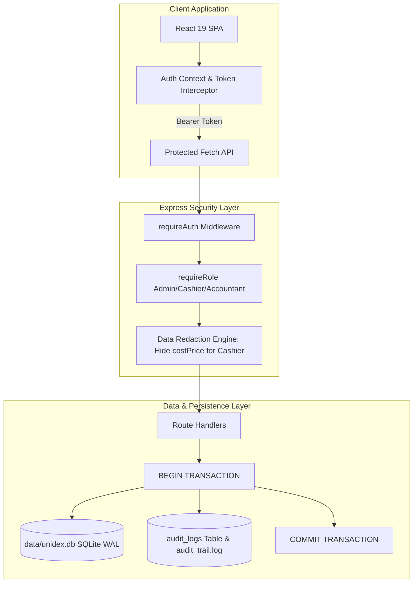

# Product Requirement Document (PRD): Sprint 2.0 — Multi-User RBAC, Security & ACID SQLite Engine
**Product:** Unidex ERP  
**Version:** 2.0.0 (Commercial Security & Data Architecture)  
**Author:** Chief Product Officer / Lead PM  
**Target Release:** Continuous Sprint Pipeline  
**Status:** Approved for Engineering Implementation  

---

## 1. Executive Summary & Problem Statement

As Unidex ERP transitions from a single-user prototype to a multi-employee commercial product, two fatal vulnerabilities must be resolved:
1. **Zero Access Boundaries:** Any staff member operating the POS counter currently has unrestricted visibility into supplier wholesale costs (`costPrice`), gross margins, purchase orders, financial settings, and can permanently delete products or wipe records.
2. **Data Concurrency & ACID Integrity:** While atomic JSON file writes protected against crash truncation in Sprint 1.1, concurrent cashier checkouts, stock deductions, and customer balance updates in high-volume retail require true transactional safety (ACID guarantees, foreign keys, row-level locking/WAL mode, and instant indexing).
3. **Statutory Non-Compliance:** The MCA audit trail mandates that every financial record and stock alteration must be irrevocably attributed to an authenticated individual user (`req.user.username`), which is impossible without user identity management.

Sprint 2.0 establishes **Multi-User RBAC (Role-Based Access Control)**, **Data Redaction**, **User-Bound MCA Audit Logs**, and an **ACID-Compliant Embedded SQLite Database Engine**.

---

## 2. Target Personas & Security Matrix

| Role | Personas | Permitted Capabilities | Prohibited Capabilities (Enforced at API & UI) |
| :--- | :--- | :--- | :--- |
| **`ADMIN`** | Store Owner, Managing Director | Complete unrestricted control across all modules, profit analytics, pricing edits, deletion, company profile, audit logs, and user management. | None. |
| **`CASHIER`** | POS Operator, Billing Clerk | Create quick bills, search products, barcode scan, print receipts, share WhatsApp bills, add walk-in customers. | **Strictly Prohibited:** Viewing product `costPrice`, viewing gross profit, deleting products, modifying base prices, accessing Admin/Settings, viewing Purchases/Suppliers. |
| **`ACCOUNTANT`** | CA, Tax Auditor, Bookkeeper | View sales registers, view purchase vouchers, generate GST reports, audit trail inspection, customer ledger reconciliation. | Modifying company tax settings or deleting transactions without admin override. |

---

## 3. Detailed Scope & Feature Specifications

### Feature A: Multi-User Authentication & Role-Based Access Control (RBAC)

#### Functional Requirements:
1. **User Model & Authentication:**
   - Seed default users with secure hashed/token credentials:
     - `admin` (Role: `ADMIN`, default PIN/Password: `admin123`)
     - `cashier` (Role: `CASHIER`, default PIN/Password: `cashier123`)
     - `accountant` (Role: `ACCOUNTANT`, default PIN/Password: `account123`)
   - API endpoints:
     - `POST /api/auth/login`: Accepts `{ username, password }`. Returns `{ token, user: { id, username, name, role } }`.
     - `GET /api/auth/me`: Validates session token and returns active user profile.
     - `POST /api/auth/logout`: Clears session.
   - Session Management: Client stores token in `localStorage`; transmits in `Authorization: Bearer <token>` header for all API calls.
2. **Backend API Middleware & Data Redaction:**
   - `requireAuth`: Middleware validating bearer token and decorating `req.user`.
   - `requireRole(allowedRoles)`: Enforces route-level RBAC (e.g., `requireRole(['ADMIN'])` on `DELETE /api/products/:id` and `PUT /api/settings`).
   - **Critical Data Redaction:**
     - On `GET /api/products`: If `req.user.role === 'CASHIER'`, redact `costPrice`, `lastPurchasePrice`, and `lastVendor` (set to `undefined` or null). Cashiers only see `sellPrice`, `mrp`, `barcode`, `stock`, `gstRate`, and `hsnCode`.
3. **Frontend UI Adaptations:**
   - Global **Login / Switch User Modal**: Prominently displayed if unauthenticated; quick switch user dropdown in the top header.
   - Dynamic Navigation: Hide `Purchases` and `Settings/Admin` tabs completely when logged in as `CASHIER`.
   - In `Inventory.tsx`, hide the "Cost Price" column and "Add/Edit/Delete" actions for `CASHIER`.

#### Acceptance Criteria:
- **AC-A1:** Cashier logging into POS cannot inspect network responses or UI to discover wholesale supplier costs (`costPrice`).
- **AC-A2:** Direct API calls by a Cashier token to delete a product (`DELETE /api/products/:id`) return `403 Forbidden`.
- **AC-A3:** Active session survives page refreshes via `localStorage`. Logging out clears session and redirects to Login modal.

---

### Feature B: User-Bound MCA Immutable Audit Trail

#### Functional Requirements:
1. **Statutory Audit Enrichment:**
   - Enhance the audit logger to mandate `username` and `role`:
     ```json
     {
       "timestamp": "2026-10-05T01:45:00.000Z",
       "user": "cashier",
       "role": "CASHIER",
       "action": "CREATE_INVOICE",
       "entity": "INVOICE",
       "entityId": "INV/26-27/00003",
       "details": { "total": 1499, "itemsCount": 2 }
     }
     ```
   - Log unauthenticated attempts or unauthorized 403 blocks for security monitoring (`UNAUTHORIZED_ACCESS_ATTEMPT`).
2. **Audit Viewer in Admin Module:**
   - Admins can view the real-time statutory audit log in `AdminModule.tsx` with date, user, role, and action badges.

#### Acceptance Criteria:
- **AC-B1:** Every created invoice and product modification in `data/audit_trail.log` records the exact username of the staff member responsible.

---

### Feature C: Embedded ACID SQLite Database Engine (`data/unidex.db`)

#### Functional Requirements:
1. **Engine Selection & Setup:**
   - Use embedded relational SQLite via `better-sqlite3` (or resilient native SQLite engine).
   - Database location: `data/unidex.db`.
   - Enable WAL mode (`PRAGMA journal_mode = WAL;`) for high concurrency and read/write separation.
   - Enforce foreign keys (`PRAGMA foreign_keys = ON;`).
2. **Relational Schema Design:**
   - `users`: `(id TEXT PRIMARY KEY, username TEXT UNIQUE, password TEXT, name TEXT, role TEXT, createdAt TEXT)`
   - `products`: `(id TEXT PRIMARY KEY, name TEXT, barcode TEXT, costPrice REAL, sellPrice REAL, mrp REAL, discount REAL, discountType TEXT, stock INTEGER, category TEXT, hsnCode TEXT, gstRate REAL, image TEXT)`
   - `parties`: `(id TEXT PRIMARY KEY, name TEXT, type TEXT, phone TEXT, email TEXT, balance REAL)`
   - `invoices`: `(id TEXT PRIMARY KEY, invoiceNumber TEXT UNIQUE, date TEXT, customer TEXT, subtotal REAL, taxTotal REAL, roundOff REAL, total REAL, paymentMethod TEXT, createdBy TEXT, itemsJson TEXT, taxBreakupJson TEXT)`
   - `purchases`: `(id TEXT PRIMARY KEY, date TEXT, vendorName TEXT, total REAL, itemsJson TEXT, createdBy TEXT)`
   - `settings`: `(id TEXT PRIMARY KEY, businessName TEXT, upiId TEXT, gstNumber TEXT, address TEXT, phone TEXT)`
   - `audit_logs`: `(id INTEGER PRIMARY KEY AUTOINCREMENT, timestamp TEXT, username TEXT, role TEXT, action TEXT, entity TEXT, entityId TEXT, detailsJson TEXT)`
3. **Automatic Migration & Backward Compatibility:**
   - On server boot, if `data/unidex.db` is empty or fresh, auto-import legacy records from `data/store.json` (if present) or seed defaults.
   - Ensure all existing API response contracts remain 100% backward compatible.
4. **Transactional Checkout:**
   - `/api/invoices` executes within a database transaction:
     - Insert invoice record.
     - Decrement product stock levels atomically.
     - Update customer ledger balance if credit.
     - Log audit record.
     - If any step fails (e.g. negative stock guardrail), rollback completely.

#### Acceptance Criteria:
- **AC-C1:** Server runs completely on `data/unidex.db` with full data persistence.
- **AC-C2:** Transactions are fully ACID compliant. Concurrent requests cannot cause partial stock deductions without an invoice record.
- **AC-C3:** Seamless automatic migration from `data/store.json` to SQLite on first startup.

---

## 4. Technical Architecture Diagram



---

## 5. Technical Task Breakdown

| Task ID | Component | Task Details | Assignee |
| :---: | :--- | :--- | :---: |
| **ENG-201** | `server.ts` | Initialize SQLite DB (`better-sqlite3` / relational tables), schemas, indexes, and WAL mode | Dev |
| **ENG-202** | `server.ts` | Implement store.json -> SQLite migration script on boot | Dev |
| **ENG-203** | `server.ts` | Implement Auth routes (`/api/auth/login`, `/me`) and JWT/token signing & verification | Dev |
| **ENG-204** | `server.ts` | Implement `requireAuth`, `requireRole`, and Cashier `costPrice` redaction middleware | Dev |
| **ENG-205** | `server.ts` | Refactor `/api/invoices`, `/products`, `/parties` to transactional SQLite queries | Dev |
| **ENG-206** | `server.ts` | Bind `req.user.username` into audit logs and store in `audit_logs` table | Dev |
| **ENG-207** | `src/context/AuthContext.tsx` | Global React Auth state, login modal, logout, token injection into fetch | Dev |
| **ENG-208** | `src/components/Header.tsx` & Views | Show user badge, role indicator, hide Admin/Purchases/costPrice for Cashier | Dev |
| **QA-201** | Test Suite | Validate Cashier API tampering blocks, transaction rollbacks, SQLite persistence | Quinn |
