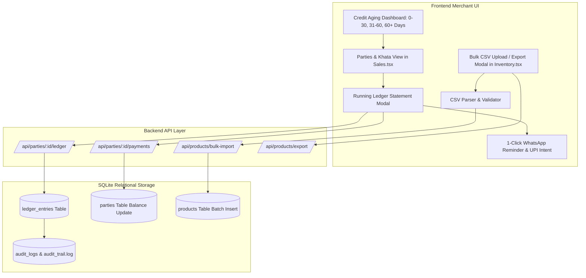

# Product Requirement Document (PRD): Sprint 3.0 — Commercial Ledgers (Khata), Credit Aging & Bulk Catalog Operations
**Product:** Unidex ERP  
**Version:** 3.0.0 (Commercial Merchant Growth & Credit Management)  
**Author:** Chief Product Officer / Lead PM (in collaboration with Senior Business Analyst)  
**Target Release:** Immediate Execution  
**Status:** Approved for Engineering Implementation  

---

## 1. Executive Summary & Market Rationale

In the Indian retail and SME trading ecosystem (estimated at over 63 million enterprises), over **70% to 80% of wholesale and neighbourhood retail transactions occur on informal credit (*Udhar*)**. 

A modern ERP that only records cash checkouts fails to capture the true operational reality of merchants. When retailers cannot track who owes what, compute overdue aging, or collect receivables quickly, cash flow collapses and they fall back to physical bahi-khata notebooks or separate apps like Khatabook and Vyapar.

Furthermore, manual product entry is the **#1 onboarding barrier**. Store owners with 500 to 5,000 SKUs abandon software if they cannot upload their catalog from an Excel/CSV spreadsheet in under 60 seconds.

Sprint 3.0 addresses these core merchant growth bottlenecks:
1. **Double-Entry Party Ledgers (*Bahi-Khata*):** Complete running debit/credit statement history for customers and suppliers.
2. **Credit Aging & 1-Click WhatsApp Payment Reminders:** Aging analysis (0-30, 31-60, 60+ days) and automated WhatsApp collection messages with UPI pay links.
3. **Bulk CSV/Excel Catalog Import & Export:** Frictionless catalog migration with validation for Barcodes, HSN, Tax slabs, and pricing guardrails.

---

## 2. Target Personas & Use Case Scenarios

| Persona | Operational Context | Primary Pain Point | Sprint 3.0 Solution |
| :--- | :--- | :--- | :--- |
| **Ramesh (Wholesale Trader)** | Supplies electronics and accessories to 50+ local retailers on credit terms (15-30 days). | Spends 4 hours every weekend manually calculating who owes how much and calling for payments. | Instant Customer Ledger Statement with Running Balance + Aging breakdown + 1-Click WhatsApp reminder with UPI intent. |
| **Suresh (Supermarket Owner)** | Migrating to Unidex ERP with 2,500 active grocery SKUs from an old Tally/Excel sheet. | Cannot spend 3 weeks manually keying in barcode, HSN, GST rate, cost, MRP, and stock. | 1-Click Bulk CSV/Excel Catalog Upload with instant error validation and sample download. |
| **Sunita (Store Accountant)** | Reconciles vendor payments with Goods Receipt and Purchase vouchers. | Vendor sends a statement with disputes; needs an itemized supplier ledger showing debits and credits. | Vendor Ledger with settlement vouchers, payment receipts, and net payable balance. |

---

## 3. Detailed Scope & Feature Specifications

### Feature A: Double-Entry Party Ledgers (Khata) & Statement Engine

#### Functional Requirements:
1. **Ledger Schema & Entries:**
   - Dedicated `ledger_entries` table in SQLite (`data/unidex.db`):
     - `id`: Primary Key (UUID/text).
     - `partyId`: Foreign Key linking to `parties(id)`.
     - `date`: ISO timestamp.
     - `type`: `INVOICE` (debit for customer, credit for vendor), `PAYMENT_RECEIVED`, `PURCHASE`, `PAYMENT_PAID`, `OPENING_BALANCE`.
     - `referenceId`: Linked invoice or payment voucher ID (`INV/26-27/00001`, `PAY/001`).
     - `debit`: Amount debited.
     - `credit`: Amount credited.
     - `runningBalance`: Balance after this transaction.
     - `notes`: Description / notes.
     - `createdBy`: Username of authenticated staff.
2. **Party Profile & Statement View:**
   - In `Sales.tsx` (Parties tab) and a dedicated Ledger Modal:
     - Header summary: Total Net Due (Receivable if positive, Payable if negative), Total Billed, Total Collected.
     - Itemized running statement table: `Date`, `Voucher Type`, `Ref #`, `Debit (+dr)`, `Credit (-cr)`, `Running Balance`.
     - "Record Payment" Action: Modal to record partial or full settlements (Cash, UPI, Cheque, Bank Transfer) with receipt generation.
3. **Automated Ledger Posting:**
   - When an invoice is finalized with `paymentMethod === 'credit'` (or partial credit):
     - Automatically insert a debit entry in `ledger_entries`.
     - Update `parties.balance`.
   - When a purchase is recorded:
     - Automatically insert a credit entry for the supplier.

#### Acceptance Criteria:
- **AC-A1:** Opening a customer's profile displays a chronologically sorted running statement showing every bill, payment, and net balance.
- **AC-A2:** Recording a ₹500 payment against an outstanding ₹1,500 invoice immediately recalculates the customer's balance to ₹1,000 and logs an entry in `ledger_entries`.
- **AC-A3:** Ledger statement can be printed or exported as a clean summary.

---

### Feature B: Credit/Udhar Aging & 1-Click WhatsApp Payment Reminders

#### Functional Requirements:
1. **Aging Analysis Engine:**
   - In the Parties / Credit management view, categorize all receivables into aging buckets:
     - **Current (0-30 days):** Healthy credit.
     - **Overdue (31-60 days):** Amber warning.
     - **Critical (60+ days):** Red alert (requires immediate follow-up).
   - Display aggregate receivables summary cards: Total Credit Outstanding, Overdue Amount (>30 days), Number of Debtors.
2. **1-Click WhatsApp Payment Reminder:**
   - Each customer ledger row with balance > 0 features a green **"Send WhatsApp Reminder"** button.
   - Generates a deep link: `https://wa.me/91{phone}?text={encodedReminderText}`.
   - Formatted WhatsApp message template:
     ```text
     Namaste *{CUSTOMER_NAME}*,

     This is a gentle reminder from *{BUSINESS_NAME}*.
     Your outstanding account balance is: *₹{BALANCE}*.

     Outstanding Invoices:
     • #{INVOICE_NO} dated {DATE} - ₹{AMOUNT}

     You can pay instantly using our UPI ID:
     👉 *{UPI_ID}*
     Or pay directly via UPI link:
     upi://pay?pa={UPI_ID}&pn={BUSINESS_NAME}&am={BALANCE}&cu=INR

     For statement queries, please reply to this message.
     Thank you!
     ```
   - If customer has no phone number, open a quick prompt to enter phone number before sharing.

#### Acceptance Criteria:
- **AC-B1:** Debtors list clearly tags accounts exceeding 30 and 60 days overdue.
- **AC-B2:** Clicking "Send WhatsApp Reminder" opens WhatsApp with the customer's exact balance, overdue invoice numbers, store UPI ID, and direct clickable UPI intent link.

---

### Feature C: Bulk CSV / Excel Catalog Import & Export

#### Functional Requirements:
1. **CSV/Excel Import Engine:**
   - Accessible via **"Import Products"** in `Inventory.tsx`.
   - Support both `.csv` and standard spreadsheet format.
   - Standard columns recognized:
     - `name` (Required): Product Title.
     - `barcode` (Optional): UPC/EAN code. If empty, auto-generate sequential barcode.
     - `category` (Optional): Product category (defaults to 'General').
     - `costPrice` (Required): Wholesale/purchase cost.
     - `sellPrice` (Required): Retail price.
     - `mrp` (Optional): Maximum Retail Price (defaults to `sellPrice`).
     - `hsnCode` (Optional): 4/6/8-digit HSN code.
     - `gstRate` (Optional): 0, 5, 12, 18, 28 (defaults to 18).
     - `stock` (Required): Current inventory on hand.
2. **Data Validation & Error Reporting:**
   - Pricing guardrails: Validate that `costPrice <= sellPrice <= mrp`. Flag rows violating this with clear error notices.
   - Duplicate detection: If barcode already exists, give option to update existing stock or skip.
   - Bulk preview table: Preview parsed items, highlighted errors, and "Confirm Import (X valid items)" button.
   - Downloadable Sample Template: Provide a 1-click **"Download Sample CSV"** button with realistic sample rows.
3. **Bulk Export Engine:**
   - 1-click **"Export Catalog (CSV)"** button in `Inventory.tsx`.
   - Generates and downloads a complete snapshot of all products with full pricing, stock, HSN, and GST rates for stock audits and CA compliance.

#### Acceptance Criteria:
- **AC-C1:** Uploading a CSV with 100 products imports them into SQLite within `< 2 seconds` with zero server restart or data loss.
- **AC-C2:** Invalid rows (e.g. text in price field, cost > sell price) are flagged in a validation error table without crashing the import process.
- **AC-C3:** "Download Sample Template" provides a valid CSV that can be immediately filled and re-uploaded.

---

## 4. Technical Architecture Diagram



---

## 5. Technical Task Breakdown for Development & Architecture

| Task ID | Component | Task Details | Assignee |
| :---: | :--- | :--- | :---: |
| **ENG-301** | `server.ts` | Create `ledger_entries` SQLite table and indexed foreign key queries | Dev |
| **ENG-302** | `server.ts` | Implement `/api/parties/:id/ledger` statement API (debit/credit/running balance) | Dev |
| **ENG-303** | `server.ts` | Implement `/api/parties/:id/payments` endpoint for recording ledger settlements | Dev |
| **ENG-304** | `server.ts` | Implement `/api/products/bulk-import` and `/api/products/export` with batch inserts | Dev |
| **ENG-305** | `src/components/Parties.tsx` | Build Customer & Vendor Ledger Modal with Running Balance and Record Payment | Dev |
| **ENG-306** | `src/components/Parties.tsx` | Build Credit Aging buckets (0-30, 31-60, 60+ days) and WhatsApp Reminder deep-link | Dev |
| **ENG-307** | `src/components/Inventory.tsx` | Build Bulk CSV Import Modal with validation preview & sample template download | Dev |
| **ENG-308** | `server.ts` | Auto-post ledger entry when invoice or purchase voucher is created on credit | Dev |
| **QA-301** | Test Suite | Verify 100-SKU CSV import performance, ledger debit/credit math, and aging calculations | Quinn |
