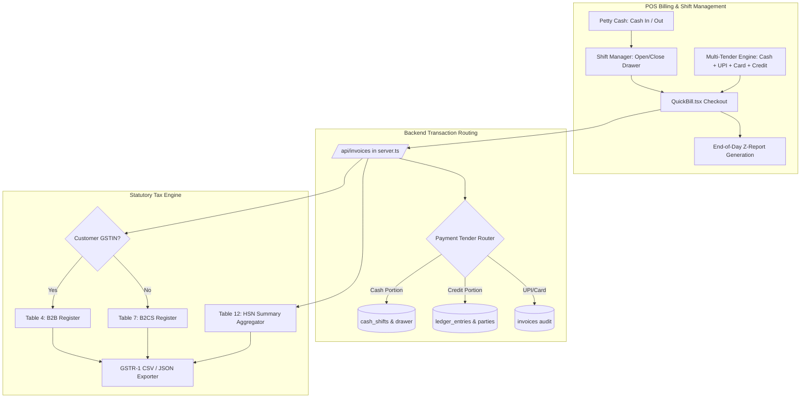

# Product Requirement Document (PRD): Sprint 4.0 — POS Cash Drawer Reconciliation, Multi-Tender Split Billing & GSTR-1 Tax Engine
**Product:** Unidex ERP  
**Version:** 4.0.0 (Financial Discipline, POS Flexibility & Statutory Tax Filing)  
**Author:** Chief Product Officer / Lead PM (in collaboration with Senior Business Analyst)  
**Target Release:** Immediate Execution  
**Status:** Approved for Engineering Implementation  

---

## 1. Executive Summary & Market Rationale

In real-world retail store operations, **cash leakage, rigid payment flows, and monthly tax filing friction** are three primary drivers of operational chaos:

1. **Cash Drawer Discrepancies (The "End-of-Day Nightmare"):** At physical retail counters, cashiers handle tens of thousands of rupees daily. Without opening float declarations, pet cash payouts (tea, courier, local vendor cash payments), and closing register reconciliation (Z-Report), store owners suffer unexplained cash shortages and shrinkage.
2. **Payment Inflexibility (Single-Tender Barrier):** Modern Indian shoppers rarely carry exact cash. Over **35% of retail counter transactions >₹1,000 involve split payments** (e.g. ₹500 in pocket cash + ₹750 via UPI / GooglePay, or part-payment on customer credit *Udhar*). Forcing an all-cash or all-UPI tender creates cashier friction, lost sales, or inaccurate bookkeeping.
3. **Statutory GSTR-1 Filing Burden:** Every registered business must file monthly/quarterly GSTR-1 returns. Chartered Accountants spend days deciphering messy transaction logs. Unidex ERP must provide automated, error-free **GSTR-1 B2B / B2C (Small) and Table 12 HSN Summary exports** compatible with the Indian GST portal and GST Offline Tool.

Sprint 4.0 introduces the **Cash Drawer Shift Engine (X & Z Reports)**, **Multi-Tender Split Billing**, and **Automated GSTR-1 Statutory Reconciliation & Export**.

---

## 2. Target Personas & Use Case Scenarios

| Persona | Operational Context | Primary Pain Point | Sprint 4.0 Solution |
| :--- | :--- | :--- | :--- |
| **Rajesh (Store Owner)** | Employs 2 counter cashiers across day and evening shifts. | Discovers ₹450 missing from the cash drawer at night; cannot determine if money was stolen, miscounted, or spent on petty cash. | Mandatory Shift Open/Close with Opening Float declaration, Cash In/Out petty cash logging, and End-of-Day Z-Report showing expected vs actual cash variance. |
| **Amit (Cashier)** | Ringing up a ₹2,400 bill during Sunday rush hour. | Customer has only ₹1,000 cash and wants to pay ₹1,400 via PhonePe QR. QuickBill previously only allowed picking one radio button. | Multi-Tender Split Payment: enter ₹1,000 Cash + ₹1,400 UPI, showing zero balance due, checkout in 2 seconds. |
| **Vikas (Chartered Accountant / Tax Auditor)** | Filing client's monthly GSTR-1 before the 11th of the month. | Sifting through raw bills to separate registered B2B invoices from unregistered B2C walk-ins and calculating per-HSN taxable values. | 1-Click GSTR-1 Report: auto-segregated into B2B (with GSTIN), B2CS (intra/inter-state), and Table 12 HSN Summary (HSN, Qty, Taxable Value, CGST/SGST/IGST). |

---

## 3. Detailed Scope & Feature Specifications

### Feature A: Cash Register Shift Engine & End-of-Day Reconciliation (Z-Report)

#### Functional Requirements:
1. **Shift Lifecycle & Cash Register Table (`cash_shifts` in SQLite):**
   - Fields:
     - `id`: Shift ID (`SHIFT-YYYYMMDD-001`).
     - `userId`: Authenticated cashier / user.
     - `openedAt`: Timestamp of shift start.
     - `closedAt`: Timestamp of shift close.
     - `openingFloat`: Cash placed in drawer at start of day/shift (e.g., ₹2,000 in change).
     - `cashSales`: Sum of all cash collected from invoices during this shift.
     - `cashIn`: Total manual petty cash additions.
     - `cashOut`: Total manual cash withdrawals/expenses.
     - `expectedCash`: Calculated as `openingFloat + cashSales + cashIn - cashOut`.
     - `actualCash`: Cashier's closing physical count.
     - `discrepancy`: `actualCash - expectedCash` (Overage or Shortage).
     - `status`: `'OPEN'` or `'CLOSED'`.
     - `notes`: Closing explanation / cashier signature note.
2. **Petty Cash Drawer Adjustments (Cash In / Cash Out):**
   - Quick Cash In/Out action modal accessible from header or QuickBill:
     - **Cash In:** e.g., Added extra ₹1,000 change from safe.
     - **Cash Out:** e.g., Paid ₹120 for staff tea, ₹350 for courier/packaging.
     - Stored in `cash_drawer_transactions` with timestamp, reason, amount, and cashier username.
3. **End-of-Day Shift Closure & Z-Report:**
   - Cashier/Admin triggers **"Close Shift / Day-End Reconciliation"**:
     - Step 1: Displays calculated totals (Cash Sales, UPI Sales, Card Sales, Credit Sales, Petty Cash Payouts).
     - Step 2: Cashier enters **Physical Cash Counted** (denominations or total sum).
     - Step 3: Displays variance in real-time (e.g., *Short by ₹50* or *Balanced*).
     - Step 4: Finalize & Print **Z-Report** (80mm thermal slip & PDF summary) summarizing:
       - Store Header, Shift ID, Cashier Name.
       - Opening Float, Cash Sales, Cash In, Cash Out.
       - Expected Cash, Physical Cash Count, Variance (Short/Over).
       - Non-Cash Totals (UPI Total, Card Total, Credit *Udhar* Total, Total Gross Sales).

#### Acceptance Criteria:
- **AC-A1:** Cashier cannot start billing in QuickBill without opening the shift or declaring opening float.
- **AC-A2:** Adding a Cash Out of ₹150 for "Tea" updates expected cash immediately and logs an entry in `cash_drawer_transactions`.
- **AC-A3:** Closing shift generates an unalterable Z-Report displaying exact cash variance and total sales broken down by payment mode.

---

### Feature B: Multi-Tender & Split Payment Billing

#### Functional Requirements:
1. **Split Payment Data Structure:**
   - Invoices store a structured `paymentDetails` array:
     ```json
     {
       "paymentMethod": "split",
       "payments": [
         { "mode": "cash", "amount": 500 },
         { "mode": "upi", "amount": 750, "reference": "UPI/489102" },
         { "mode": "credit", "amount": 249, "partyId": "P-101" }
       ],
       "totalPaid": 1250,
       "balanceDue": 249
     }
     ```
2. **QuickBill & Sales Checkout UI:**
   - In the Checkout Modal, provide payment options:
     - **Single Mode:** Quick 1-click Cash or UPI buttons.
     - **Split Tender Mode:** Allows entering amounts across:
       - **Cash:** Text input with fast denomination buttons (+₹100, +₹500, +₹2000).
       - **UPI:** Dynamic QR code automatically updates to show only the remaining UPI portion.
       - **Card:** Enter reference/auth code.
       - **Credit (Udhar):** Enabled only if a registered customer is selected; records remaining balance into customer's Khata ledger.
   - Real-time Balance / Change Counter:
     - Shows `Total Payable`, `Amount Tendered`, and `Remaining Due / Change to Return`.
     - Checkout button enabled only when `Remaining Due === 0` (or remainder is booked to credit).
3. **Receipt & Audit Trail Integration:**
   - Thermal receipt displays the exact split breakdown:
     ```text
     PAID VIA:
     • Cash:      ₹500.00
     • UPI:       ₹750.00
     • Customer Credit: ₹249.00
     ```
   - Cash register engine credits only the cash portion (`₹500`) to the drawer; ledger engine logs the credit portion (`₹249`).

#### Acceptance Criteria:
- **AC-B1:** Invoicing a ₹1,250 bill with ₹500 Cash and ₹750 UPI records ₹500 in drawer cash sales and ₹750 in UPI sales.
- **AC-B2:** Thermal receipt clearly lists each payment mode and amount tendered.
- **AC-B3:** If credit tender is used, only registered customers are allowed, and their ledger balance is incremented by the credit amount.

---

### Feature C: Statutory GSTR-1 Tax Reconciliation & Export

#### Functional Requirements:
1. **GSTR-1 Reconciliation Tables:**
   - In `AdminModule.tsx` or a dedicated **Tax Reports** view, provide monthly and quarterly GSTR-1 generation:
     - **Table 4 (B2B Invoices):** All sales made to registered businesses (where customer has a valid 15-character GSTIN). Includes Customer GSTIN, Legal Name, Invoice No, Date, Invoice Value, Place of Supply (POS), Reverse Charge (N), Invoice Type (Regular), Taxable Value, and Tax amounts (IGST / CGST / SGST).
     - **Table 7 (B2C Small Invoices):** Aggregated intra-state and inter-state sales made to unregistered retail consumers, grouped by Place of Supply and GST Rate (0%, 5%, 12%, 18%, 28%).
     - **Table 12 (HSN Summary of Outward Supplies):** Mandatory summary showing:
       - `HSN`: 4, 6, or 8-digit HSN code.
       - `Description`: Item description.
       - `UQC`: Unit Quantity Code (NOS, KGS, PCS, BOX).
       - `Total Quantity`: Sum of quantities sold.
       - `Total Value`: Gross value.
       - `Taxable Value`: Base taxable amount.
       - `Integrated Tax (IGST)`: Inter-state tax.
       - `Central Tax (CGST)`: Intra-state central tax.
       - `State/UT Tax (SGST)`: Intra-state state tax.
       - `Cess Amount`: Applicable cess.
2. **Export Capabilities:**
   - **GSTR-1 Excel / CSV Export:** Formatted in strict compliance with the GST Offline Tool schema for direct import into GSTN software.
   - **GSTR-1 JSON Payload:** Formatted JSON payload conforming to the Government e-Way / GST portal JSON schema for 1-click upload.
   - **On-Screen Tax Audit View:** Allows CA / Accountant to review taxable turnovers and tax liabilities before filing.

#### Acceptance Criteria:
- **AC-C1:** An invoice to a customer with GSTIN automatically routes to GSTR-1 Table 4 (B2B); walk-in invoices route to Table 7 (B2CS).
- **AC-C2:** Table 12 HSN summary accurately sums quantities, taxable values, and tax amounts per HSN without mathematical discrepancy.
- **AC-C3:** CSV / Excel download matches the official GSTN offline template columns.

---

## 4. Technical Architecture Diagram



---

## 5. Technical Task Breakdown

| Task ID | Component | Task Details | Assignee |
| :---: | :--- | :--- | :---: |
| **ENG-401** | `server.ts` | SQLite tables for `cash_shifts` and `cash_drawer_transactions` with shift APIs (`/api/shifts/*`) | Dev |
| **ENG-402** | `server.ts` | Update `/api/invoices` to support multi-tender split payment payloads and route cash portions to active shift | Dev |
| **ENG-403** | `server.ts` | GSTR-1 engine API (`/api/reports/gstr1`) generating Table 4 (B2B), Table 7 (B2CS), and Table 12 (HSN) | Dev |
| **ENG-404** | `src/components/QuickBill.tsx` | Build Multi-Tender Split Payment Modal with real-time balance due, denomination keys, and dynamic UPI QR | Dev |
| **ENG-405** | `src/components/CashRegisterModal.tsx` | Build Shift Open/Close modal, Cash In/Out petty cash logger, and printable Z-Report | Dev |
| **ENG-406** | `src/components/GSTR1Report.tsx` | Build GSTR-1 Tax Report dashboard in AdminModule with period filter, Table 4/7/12 tabs, and CSV/JSON export | Dev |
| **ENG-407** | `src/components/QuickBill.tsx` | Print thermal receipt with multi-tender split breakdown | Dev |
| **QA-401** | Test Suite | Validate cash drawer variance math, split payment tender integrity, and GSTR-1 HSN tax calculations | Quinn |
