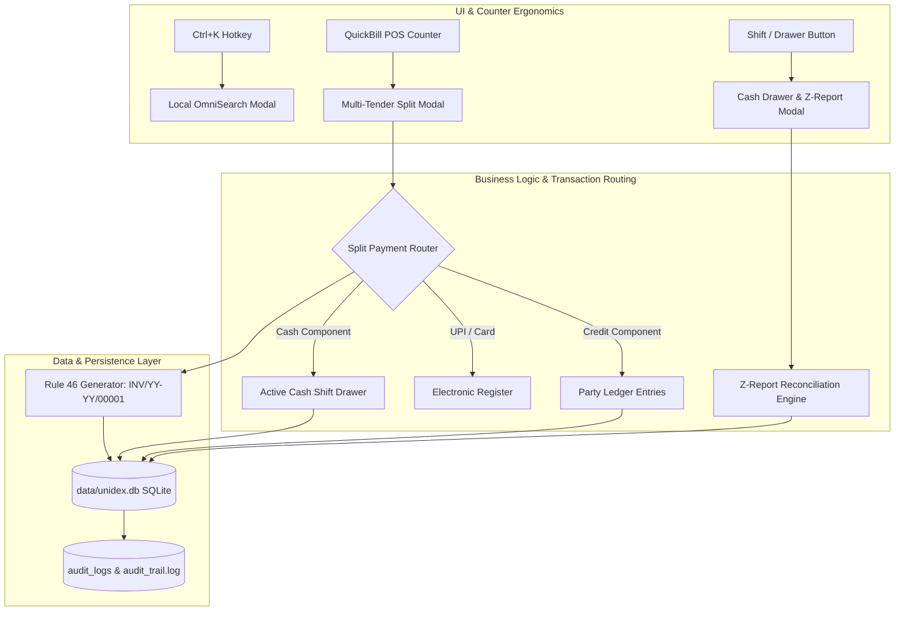

# Product Requirement Document (PRD): Sprint 4.0 — Counter Pilot Hardening, Multi-Tender & Cash Drawer Reconciliation
**Product:** Unidex ERP  
**Version:** 1.5.0 (Sprint 4.0: "Win the Counter First")  
**Author:** Priya (Chief Product Officer / Lead PM) & Rohan (Senior Business Analyst)  
**Target Release:** Immediate Engineering Implementation  
**Status:** Approved by Product Owner & Greenlit for Execution  

---

## 1. Executive Summary & Problem Statement

Unidex ERP v1.4.0 laid down our offline-first SQLite core, granular GST engine, and double-entry Khata ledgers. However, to pass the **"20-Merchant Pilot Test"** on live retail billing counters, four critical friction points must be solved immediately:

1. **Statutory 16-Character Overflow Risk:** Under Rule 46 of the CGST Rules, 2017, an invoice serial number must **never exceed 16 characters**. Arbitrary custom prefixes or timestamp combinations risk legal invalidation by tax auditors.
2. **Single-Tender Checkout Friction:** Over 35% of Indian retail transactions involve split payment (e.g. ₹500 in pocket cash + ₹750 via UPI QR, or part-payment charged to customer *Udhar*). Forcing an all-or-nothing payment mode creates counter queues, cashier workarounds, and distorted books.
3. **End-of-Day Cash Leakage & Shrinkage:** Without formal shift tracking, opening float declarations, and petty cash expense logging (tea, courier, vendor cash payouts), store owners face unexplained cash shortages every evening.
4. **Counter Cognitive Load:** Cashiers and store owners spend too many clicks navigating between menus to check stock levels, view customer credit balances, or jump to settings.

Sprint 4.0 establishes **Strict 14/15-Character Rule 46 Numbering**, **Multi-Tender Split Billing**, **Cash Drawer Shift Management with Z-Reports**, and a **Zero-Cost Local OmniSearch Command Palette (`Ctrl+K`)**.

---

## 2. Target Personas & Core User Journeys

| Persona | Role | Core Sprint 4.0 User Journey |
| :--- | :--- | :--- |
| **Rajesh (Store Owner)** | Opens shop at 9:00 AM, inspects daily profit, closes shop at 9:30 PM. | Declares opening float (₹2,000), monitors shift payouts throughout the day, and prints an unalterable **Z-Report** at closing comparing expected cash vs physical cash in drawer. |
| **Amit (Cashier)** | Handles peak customer queues (6:00 PM – 9:00 PM). | Renders a ₹1,250 bill, accepts ₹500 cash + ₹750 UPI via dynamic QR, enters the split in 2 seconds, and hands customer a clean thermal receipt. |
| **Meera (Legal / CA)** | Verifies GST compliance. | Audits invoice serial numbers; verifies all invoices conform to `INV/YY-YY/00001` (strictly $\le 16$ characters) and GSTR-1 formats. |

---

## 3. Detailed Scope & Feature Specifications

### Feature 1: Statutory Rule 46 Strict 15-Character Sequential Numbering

#### Functional Requirements:
- **Format:** `INV/YY-YY/00001`
  - Example: `INV/26-27/00001` (Exact length: **14 characters**).
  - Prefix: 3 chars (`INV`) + separator (`/`) + 2-digit start FY (`26`) + hyphen (`-`) + 2-digit end FY (`27`) + separator (`/`) + 5-digit zero-padded sequence (`00001`).
  - Total length: 14 characters, leaving a 2-character safety margin well under the statutory 16-character legal limit.
- **Financial Year Calculation:**
  - Auto-calculated based on Indian Financial Year (1st April – 31st March):
    - Dates from April 1, 2026 to March 31, 2027 map to `26-27`.
  - Stored in `data/unidex.db` with an atomic sequence counter per FY:
    - `invoice_sequences (financial_year TEXT PRIMARY KEY, last_number INTEGER)`
- **Prefix Guardrail:**
  - If store owners configure a custom prefix in Admin Settings (e.g. `BL/`), enforce a hard UI and backend validation capping prefix length such that `prefix + "/YY-YY/" + 00001` $\le 16$ characters.

#### Acceptance Criteria:
- **AC-1.1:** Every generated invoice ID strictly adheres to `INV/YY-YY/00001` and never exceeds 16 characters under any configuration.
- **AC-1.2:** Transitions across financial year boundaries automatically reset sequence to `00001` without manual intervention.

---

### Feature 2: Multi-Tender & Split Payment Billing in QuickBill

#### Functional Requirements:
- **Split Payment Data Model:**
  ```typescript
  interface SplitPayment {
    mode: 'cash' | 'upi' | 'card' | 'credit';
    amount: number;
    reference?: string; // UTR for UPI / Card auth code
    partyId?: string;   // Required if mode === 'credit'
  }
  ```
- **Checkout Modal UI:**
  - **Quick Single Tenders:** Fast 1-click buttons for [Cash Only] or [UPI Only].
  - **Split Tender Mode:**
    - Line item table of payment methods.
    - Cash tender input with quick denomination chips (`+₹100`, `+₹500`, `+₹2000`).
    - UPI tender input: When entered, the dynamic zero-cost UPI QR code updates in real time to show **only the remaining UPI portion**.
    - Card tender input with optional UTR/Ref field.
    - Customer Credit (*Udhar*) tender: Enabled only when a registered customer is selected; debits the remaining balance to their Khata ledger.
  - **Real-Time Balance & Change Indicator:**
    - Displays: `Bill Total`, `Total Tendered`, and `Remaining Due / Change to Return`.
    - "Complete Bill" button is disabled until `Remaining Due === 0` (or remainder is booked to credit).
- **Thermal Receipt & Ledger Distribution:**
  - Printed 80mm/58mm thermal receipt itemizes the exact payment split:
    ```text
    PAYMENT BREAKDOWN:
    • Cash:             ₹500.00
    • UPI (Ref: 4891):  ₹750.00
    ---------------------------
    Total Paid:       ₹1,250.00
    ```
  - Backend transaction routing:
    - Cash portion (`₹500`) is added to the active cash drawer shift.
    - Credit portion (if any) is posted into `ledger_entries` for the customer.

#### Acceptance Criteria:
- **AC-2.1:** A bill of ₹1,250 can be tendered across ₹500 Cash and ₹750 UPI with zero rounding errors or ledger misalignment.
- **AC-2.2:** Customer credit tender is blocked for anonymous Walk-in customers and only permitted for registered parties.

---

### Feature 3: Cash Drawer Shift Management & Day-End Z-Report

#### Functional Requirements:
- **Shift Lifecycle (`cash_shifts` table in SQLite):**
  - `id`: `SHIFT-YYYYMMDD-001`
  - `userId`: Staff ID/Username.
  - `openedAt`: ISO timestamp.
  - `closedAt`: ISO timestamp (nullable).
  - `openingFloat`: Cash in drawer at start of shift (e.g. ₹2,000).
  - `cashSales`: Sum of cash collected across invoices during this shift.
  - `cashIn`: Total manual petty cash additions.
  - `cashOut`: Total manual petty cash expenses/payouts.
  - `expectedCash`: `openingFloat + cashSales + cashIn - cashOut`.
  - `actualCash`: Cashier's closing physical cash count.
  - `discrepancy`: `actualCash - expectedCash` (Positive = Overage, Negative = Shortage).
  - `status`: `'OPEN'` | `'CLOSED'`.
  - `notes`: Closing cashier note.
- **Petty Cash Operations (`cash_drawer_transactions`):**
  - Cash In: Add extra change from safe into drawer.
  - Cash Out: Pay petty expenses (tea/coffee, packaging material, vendor cash settlement).
  - Logs: `timestamp`, `type` (IN/OUT), `amount`, `category`, `reason`, `cashier`.
- **End-of-Day Shift Close & Z-Report:**
  - Cashier enters physical cash count (denominations counter: ₹2000, ₹500, ₹200, ₹100, ₹50, ₹20, ₹10, coins).
  - Displays variance (e.g., *Balanced* or *Short by ₹40.00*).
  - Generates and prints an unalterable **Z-Report** slip:
    - Store Header, Date & Shift Duration, Cashier Name.
    - Financial Summary: Opening Float, Cash In, Cash Out, Cash Sales, Non-Cash Sales (UPI, Card, Credit).
    - Closing Summary: Expected Cash, Actual Counted Cash, Discrepancy (Over/Short).

#### Acceptance Criteria:
- **AC-3.1:** Cashier must declare opening float when opening the drawer shift before billing in QuickBill.
- **AC-3.2:** Day-End Z-Report calculates expected cash accurately across all cash sales and petty cash entries, flagging any shortage or overage.
- **AC-3.3:** Z-Report is printable on 80mm thermal printer and archived permanently in SQLite.

---

### Feature 4: Zero-Cost Local OmniSearch Command Palette (`Ctrl+K`)

#### Functional Requirements:
- **Trigger & UI:**
  - Global hotkey: `Ctrl+K` (Windows/Linux) or `Cmd+K` (macOS).
  - Floating centered modal overlay with keyboard navigation (`↑`/`↓` to highlight, `Enter` to select, `Esc` to close).
- **Instant Local Search Engine (Zero API Cost, < 15ms):**
  - Searches 100% in local memory / SQLite index without network roundtrips.
  - **Inventory Lookups:** Type item name or barcode $\rightarrow$ Shows SKU, Selling Price, available Stock count, and Low Stock alert pill.
  - **Customer & Party Lookups:** Type customer name or phone $\rightarrow$ Shows Party name, current Khata Balance (`₹2,400 Due`), and a 1-click `[Send WhatsApp Reminder]` action.
  - **Direct Command Navigation:** Type `"new bill"`, `"inventory"`, `"settings"`, `"z-report"`, `"import csv"` $\rightarrow$ Instantly switches to the target module or triggers the modal.
- **Security & Margin Redaction:**
  - When logged in as `CASHIER`, product search results strictly redact wholesale `costPrice` and supplier details.

#### Acceptance Criteria:
- **AC-4.1:** Pressing `Ctrl+K` opens the search modal within 50ms from any screen in the application.
- **AC-4.2:** Searching a product displays live stock levels and allows adding directly to QuickBill cart.
- **AC-4.3:** Searching a customer displays their current credit balance and allows opening their ledger statement.

---

## 4. Technical Architecture Diagram



---

## 5. Technical Task Breakdown & Ownership

| Task ID | Component | Task Details | Assignee |
| :---: | :--- | :--- | :---: |
| **ENG-401** | `server.ts` | Implement Rule 46 14-char generator (`INV/26-27/00001`) with FY boundary handling | Dev |
| **ENG-402** | `server.ts` | SQLite tables for `cash_shifts` and `cash_drawer_transactions` with full shift APIs | Dev |
| **ENG-403** | `server.ts` | Multi-tender payload ingestion in `/api/invoices`, routing cash portions to drawer | Dev |
| **ENG-404** | `src/components/OmniSearch.tsx` | Build `Ctrl+K` floating command palette with instant local SKU/party/route search | Dev |
| **ENG-405** | `src/components/CashDrawerModal.tsx` | Shift open/close modal, petty cash in/out logger, and printable Z-Report | Dev |
| **ENG-406** | `src/components/QuickBill.tsx` | Multi-tender checkout modal with dynamic UPI QR and split thermal print | Dev |
| **ENG-407** | `src/components/Header.tsx` | Add Shift status badge (Open/Closed) and `Ctrl+K` search bar trigger | Dev |
| **QA-401** | Test Suite | Verify 14-char invoice limit, split tender reconciliation math, and Z-report accuracy | Quinn |
| **DES-401** | Design | Visual blueprints for Split Tender modal, Shift Drawer, and OmniSearch palette | Leo |
| **ARCH-401**| Architecture | Schema validation, foreign key constraints, and transactional consistency review | Zara |
