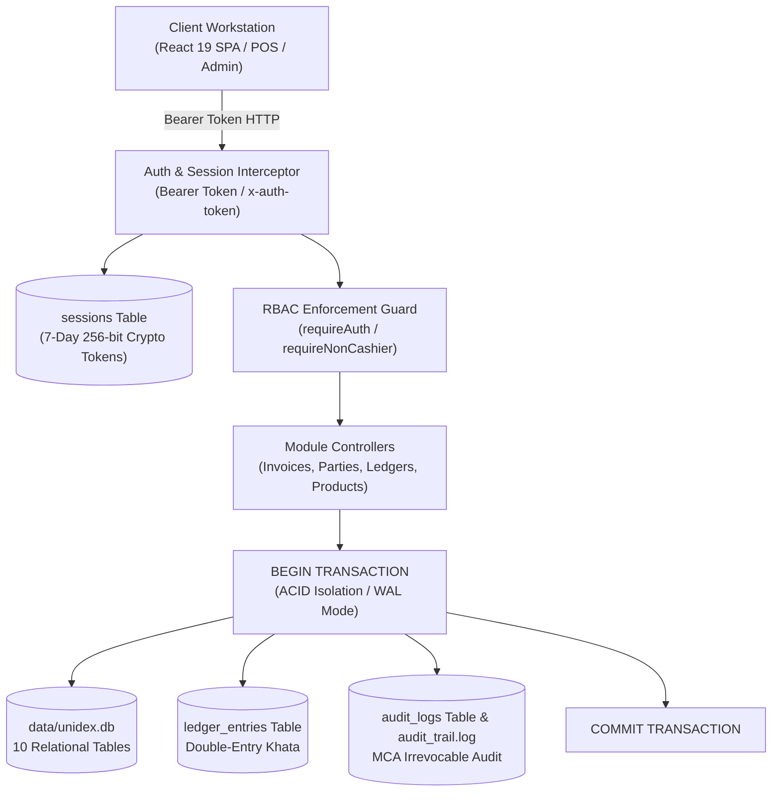
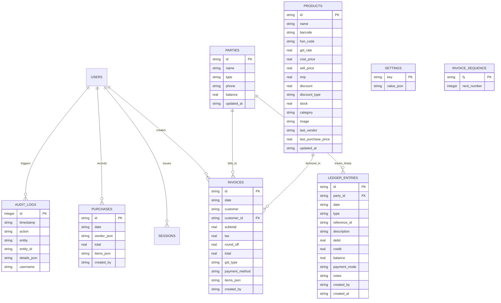

# Unidex ERP — System & API Architecture Guide
**Document Version:** 3.0.0 (Commercial Ledgers, Credit Aging & Bulk Operations Release v1.4.0)  
**Target Audience:** Backend Engineers, Security Architects, Systems Integrators, Compliance Auditors  
**Scope:** Embedded SQLite Relational Schema, Double-Entry Ledger Mechanics, Credit Aging, Bulk Catalog Operations, REST Endpoints

---

## 1. System Architecture Overview

Unidex ERP runs on a high-concurrency Node.js / Express backend with an ACID-compliant embedded relational SQLite storage engine (`data/unidex.db`), complemented by a React 19 + TypeScript frontend.



### Core Architecture Highlights:
1. **Embedded ACID SQLite Database (`data/unidex.db`):** Uses Node's built-in `node:sqlite` `DatabaseSync` engine with **Write-Ahead Logging (`PRAGMA journal_mode = WAL;`)** for zero-latency concurrent reads/writes and **Foreign Keys enabled (`PRAGMA foreign_keys = ON;`)**.
2. **Double-Entry Khata & Ledger Subsystem:** Dedicated `ledger_entries` table recording debit and credit mutations for customer receivables and vendor liabilities with immutable running balances.
3. **Credit Aging & Recovery Analytics:** Real-time receivables grouping across three risk buckets: `0-30 days` (current), `31-60 days` (overdue), and `60+ days` (critical).
4. **Bulk Catalog Processing:** Atomic CSV ingestion with price sanity validations (`costPrice <= sellPrice <= mrp`), stock assignment, and formula-injection-safe CSV catalog exports.
5. **Multi-User RBAC & Data Redaction:** Enforces strict role isolation across `admin`, `accountant`, and `cashier` personas, stripping confidential wholesale cost data at the database query mapping layer.
6. **Statutory MCA Section 134(5) Compliance:** Dual-writes all financial events and catalog mutations both into the relational `audit_logs` table and an immutable append-only text log at `data/audit_trail.log`.

---

## 2. SQLite Relational Database Schema (`data/unidex.db`)

The database consists of 10 fully normalized relational tables with automatic index creation on server initialization.



### Table DDL Specifications

```sql
-- 1. Operator and User Credentials
CREATE TABLE IF NOT EXISTS users (
  id TEXT PRIMARY KEY,
  username TEXT UNIQUE NOT NULL,
  password TEXT NOT NULL,
  name TEXT NOT NULL,
  role TEXT NOT NULL, -- 'admin' | 'cashier' | 'accountant'
  created_at TEXT NOT NULL
);

-- 2. Cryptographic Session Tokens
CREATE TABLE IF NOT EXISTS sessions (
  token TEXT PRIMARY KEY,
  user_id TEXT NOT NULL,
  username TEXT NOT NULL,
  name TEXT NOT NULL,
  role TEXT NOT NULL,
  created_at TEXT NOT NULL,
  expires_at TEXT NOT NULL
);

-- 3. Inventory and Product Catalog
CREATE TABLE IF NOT EXISTS products (
  id TEXT PRIMARY KEY,
  name TEXT NOT NULL,
  barcode TEXT,
  hsn_code TEXT,
  gst_rate REAL DEFAULT 18,
  cost_price REAL DEFAULT 0,
  sell_price REAL NOT NULL,
  mrp REAL,
  discount REAL DEFAULT 0,
  discount_type TEXT DEFAULT 'amount',
  stock REAL DEFAULT 0,
  category TEXT DEFAULT 'General',
  image TEXT,
  last_vendor TEXT,
  last_purchase_price REAL,
  updated_at TEXT NOT NULL
);

-- 4. Customer and Vendor Directory
CREATE TABLE IF NOT EXISTS parties (
  id TEXT PRIMARY KEY,
  name TEXT NOT NULL,
  type TEXT NOT NULL, -- 'customer' | 'vendor'
  phone TEXT,
  balance REAL DEFAULT 0,
  updated_at TEXT NOT NULL
);

-- 5. Double-Entry Commercial Ledger (Khata)
CREATE TABLE IF NOT EXISTS ledger_entries (
  id TEXT PRIMARY KEY,
  party_id TEXT NOT NULL,
  date TEXT NOT NULL,
  type TEXT NOT NULL,        -- 'sale' | 'payment' | 'purchase' | 'purchase_payment'
  reference_id TEXT,        -- INV/..., PUR/..., or PAY-...
  description TEXT,
  debit REAL DEFAULT 0,     -- Increases receivable (sale) or decreases vendor liability
  credit REAL DEFAULT 0,    -- Decreases receivable (receipt) or increases vendor debt
  balance REAL NOT NULL,    -- Running ledger balance after this entry
  payment_mode TEXT,        -- 'cash' | 'upi' | 'cheque' | 'bank_transfer' | 'credit'
  notes TEXT,
  created_by TEXT DEFAULT 'system',
  created_at TEXT NOT NULL,
  FOREIGN KEY (party_id) REFERENCES parties(id) ON DELETE CASCADE
);

CREATE INDEX IF NOT EXISTS idx_ledger_party_date ON ledger_entries(party_id, date);
CREATE INDEX IF NOT EXISTS idx_ledger_ref ON ledger_entries(reference_id);

-- 6. Finalized Sales Invoices
CREATE TABLE IF NOT EXISTS invoices (
  id TEXT PRIMARY KEY,      -- Formatted: INV/{FY}/{Sequence} e.g., INV/2026-27/00001
  date TEXT NOT NULL,
  customer TEXT NOT NULL,
  customer_id TEXT,
  subtotal REAL NOT NULL,
  tax REAL NOT NULL,
  round_off REAL DEFAULT 0,
  total REAL NOT NULL,
  gst_type TEXT DEFAULT 'GST',
  payment_method TEXT DEFAULT 'cash',
  items_json TEXT NOT NULL,
  created_by TEXT DEFAULT 'system'
);

-- 7. Procurement & Vendor Shipments
CREATE TABLE IF NOT EXISTS purchases (
  id TEXT PRIMARY KEY,
  date TEXT NOT NULL,
  vendor_json TEXT,
  total REAL NOT NULL,
  items_json TEXT NOT NULL,
  created_by TEXT DEFAULT 'system'
);

-- 8. Key-Value Company Configuration
CREATE TABLE IF NOT EXISTS settings (
  key TEXT PRIMARY KEY,
  value_json TEXT NOT NULL
);

-- 9. Concurrency-Safe Financial Year Sequence
CREATE TABLE IF NOT EXISTS invoice_sequence (
  fy TEXT PRIMARY KEY,      -- e.g. '2026-27'
  next_number INTEGER NOT NULL
);

-- 10. MCA Section 134(5) Statutory Audit Trail
CREATE TABLE IF NOT EXISTS audit_logs (
  id INTEGER PRIMARY KEY AUTOINCREMENT,
  timestamp TEXT NOT NULL,
  action TEXT NOT NULL,
  entity TEXT NOT NULL,
  entity_id TEXT,
  details_json TEXT,
  username TEXT NOT NULL
);
```

---

## 3. Double-Entry Accounting Mechanics (`ledger_entries`)

Unidex ERP maintains double-entry accounting integrity across both customer (receivable) and vendor (payable) ledgers:

### 3.1 Customer Khata (Receivables Ledger)
- **Positive Balance:** Customer owes money to the store (`Receivable / Debit balance`).
- **Credit Sale:** When an invoice is created with `paymentMethod === 'credit'` or `'unpaid'`:
  - `debit = invoiceTotal`
  - `credit = 0`
  - `newBalance = previousBalance + invoiceTotal`
- **Customer Settlement Payment:** When customer pays via Cash/UPI:
  - `debit = 0`
  - `credit = paymentAmount`
  - `newBalance = previousBalance - paymentAmount`

### 3.2 Vendor Khata (Payables Ledger)
- **Negative Balance:** Store owes money to the supplier (`Payable / Credit liability`).
- **Procurement Delivery:** When a purchase voucher is posted:
  - `debit = 0`
  - `credit = purchaseTotal`
  - `newBalance = previousBalance - purchaseTotal` (liability increases)
- **Supplier Payment:** When store pays vendor via Bank/UPI/Cash:
  - `debit = paymentAmount`
  - `credit = 0`
  - `newBalance = previousBalance + paymentAmount` (liability moves toward 0)

---

## 4. REST API Endpoint Reference

All endpoints accept and return standard `application/json` (except `/api/products/export` which returns `text/csv`).

### 4.1 Ledger Passbook Endpoint
#### `GET /api/parties/:id/ledger`
Retrieves chronological statement of all transactions and payments for a party.

- **Security:** `requireAuth` (Admin, Accountant, or Cashier).
- **URL Parameter:** `id` (Party ID, e.g. `P1` or `P-1718012345678`)
- **Success Response (200 OK):**
  ```json
  {
    "party": {
      "id": "P1",
      "name": "John Doe",
      "type": "customer",
      "phone": "9876543210",
      "balance": 1500
    },
    "entries": [
      {
        "id": "LED-1718012345-101",
        "date": "2026-10-01T10:00:00.000Z",
        "type": "sale",
        "referenceId": "INV/2026-27/00001",
        "description": "Credit Sale Invoice INV/2026-27/00001",
        "debit": 2000,
        "credit": 0,
        "balance": 2000,
        "paymentMode": "credit",
        "notes": "Credit Sale for ₹2000",
        "createdBy": "cashier",
        "createdAt": "2026-10-01T10:00:00.000Z"
      },
      {
        "id": "PAY-1718098765-202",
        "date": "2026-10-04T15:30:00.000Z",
        "type": "payment",
        "referenceId": "PAY-1718098765-202",
        "description": "Received from John Doe via UPI",
        "debit": 0,
        "credit": 500,
        "balance": 1500,
        "paymentMode": "upi",
        "notes": "Partial settlement via PhonePe",
        "createdBy": "admin",
        "createdAt": "2026-10-04T15:30:00.000Z"
      }
    ]
  }
  ```

---

### 4.2 Settlement Payment Endpoint
#### `POST /api/parties/:id/payments`
Records an atomic cash, UPI, cheque, or bank transfer settlement payment against a party account.

- **Security:** `requireAuth`.
- **URL Parameter:** `id` (Party ID)
- **Request Body:**
  ```json
  {
    "amount": 500,
    "paymentMode": "upi",
    "reference": "UPI/TXN/998877",
    "notes": "Paid via Google Pay"
  }
  ```
- **ACID Transaction Execution:**
  1. Validates amount > 0.
  2. Updates `parties.balance` and `updated_at`.
  3. Inserts balancing entry in `ledger_entries`.
  4. Records statutory entry in `audit_logs`.
- **Success Response (201 Created):**
  ```json
  {
    "success": true,
    "partyId": "P1",
    "amount": 500,
    "newBalance": 1500,
    "paymentMode": "upi",
    "reference": "UPI/TXN/998877",
    "date": "2026-10-05T02:00:00.000Z"
  }
  ```

---

### 4.3 Credit Aging Summary Endpoint
#### `GET /api/parties/aging-summary`
Performs real-time receivables aging across all customer balances based on days elapsed since the oldest unpaid ledger debit.

- **Security:** `requireAuth`.
- **Success Response (200 OK):**
  ```json
  {
    "totalReceivables": 45000,
    "buckets": {
      "current_0_30": 25000,
      "overdue_31_60": 12000,
      "critical_60_plus": 8000
    },
    "customers": [
      {
        "id": "P1",
        "name": "Acme Traders",
        "phone": "9876543210",
        "balance": 8000,
        "oldestDueDays": 64,
        "bucket": "60+",
        "status": "critical"
      },
      {
        "id": "P3",
        "name": "Bharat Stores",
        "phone": "9123456789",
        "balance": 12000,
        "oldestDueDays": 38,
        "bucket": "31-60",
        "status": "overdue"
      }
    ]
  }
  ```

---

### 4.4 Bulk Product Catalog Import Endpoint
#### `POST /api/products/bulk`
Executes batch validation and bulk insertion of catalog items in an atomic database transaction.

- **Security:** `requireNonCashier` (Admin or Accountant only).
- **Request Body:**
  ```json
  {
    "products": [
      {
        "name": "Samsung 25W Charger",
        "barcode": "8901234567800",
        "hsnCode": "8504",
        "gstRate": 18,
        "costPrice": 450,
        "sellPrice": 999,
        "mrp": 1299,
        "stock": 25,
        "category": "Electronics"
      }
    ]
  }
  ```
- **Validation Rules:**
  - `name`: Must not be blank.
  - `sellPrice`: Must be a valid number > 0.
  - `costPrice`: Must not exceed `sellPrice` (`costPrice <= sellPrice`).
  - `mrp`: Defaults to `sellPrice` if omitted.
- **Success Response (201 Created):**
  ```json
  {
    "importedCount": 1,
    "rejectedCount": 0,
    "errors": [],
    "products": [...]
  }
  ```
- **Error Response (422 Unprocessable Entity):** Returns detailed row numbers and failure reasons if all rows are rejected.

---

### 4.5 Product Catalog CSV Export Endpoint
#### `GET /api/products/export`
Generates and downloads the full inventory catalog as an RFC 4180-compliant CSV file.

- **Security:** `requireAuth`.
- **RBAC Redaction Rule:** If request is authenticated with `role === 'cashier'`, wholesale procurement columns (`costPrice`, `lastVendor`, `lastPurchasePrice`) are excluded from output headers and rows.
- **CSV Injection Neutralization:** Prepends single-quote escape (`'`) if any cell value begins with dangerous spreadsheet formula triggers (`=`, `+`, `-`, `@`, `\t`, `\r`).
- **Response Headers:**
  - `Content-Type: text/csv`
  - `Content-Disposition: attachment; filename="unidex_catalog_<timestamp>.csv"`
