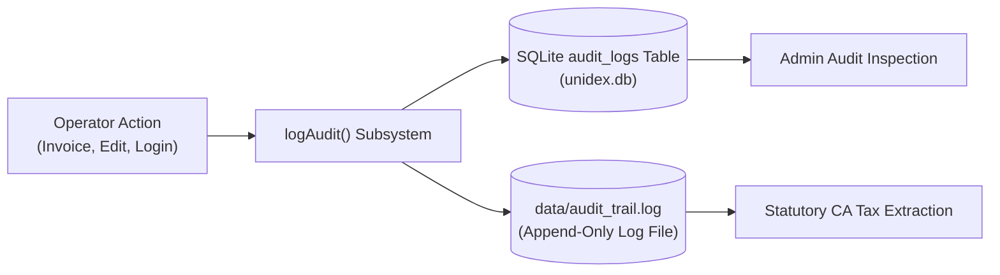

# Unidex ERP — User Management & RBAC Administration Guide
**Document Version:** 1.3.0 (Sprint 2.0 Production Release)  
**Target Audience:** Store Owners, System Administrators, Chief Accountants, Internal Auditors  
**Governing Standard:** Indian Companies Act (MCA) Section 134(5) Statutory Audit Standards & Retail Security Guidelines

---

## 1. Store Administrator Guide: Managing Roles & Credentials

Unidex ERP enforces strict multi-user access boundaries to protect wholesale supplier pricing, business profit margins, and statutory financial ledgers.

### 1.1 Pre-Configured Operator Roles

The system seeds three operational user profiles with differentiated privileges:

| Username | Full Name | Assigned Role | Default Password / PIN | Operational Scope |
| :--- | :--- | :--- | :--- | :--- |
| `admin` | Admin Owner | **`admin`** | `admin123` | Complete store control: pricing, P&L, supplier procurement, company settings, and audit logs. |
| `accountant` | Lead Accountant | **`accountant`** | `acct123` | General ledger, sales analysis, purchase registers, GST audits, and compliance exports. |
| `cashier` | Counter Cashier | **`cashier`** | `cashier123` | POS counter billing, barcode scanning, thermal printing, and WhatsApp invoice dispatching. |

> [!CAUTION]
> **Production Hardening Requirement:** Upon deploying Unidex ERP on a live store server, store administrators must immediately update default passwords in the database to prevent unauthorized access.

### 1.2 Switching Operator Profiles
Operators can transition between cashier shifts or administrative reviews without reloading the application:
1. Click the **Operator Profile Card** located at the top of the left sidebar (Desktop) or click the profile badge in the header (Mobile).
2. The **Switch Operator Profile** modal will display active credentials.
3. Select the incoming user profile (`Admin Owner`, `Counter Cashier`, or `Lead Accountant`).
4. Enter the password/PIN.
5. Upon confirmation, the application securely stores a 256-bit cryptographic token in browser storage, regenerates session state via `GET /api/auth/me`, and adjusts navigation tabs in real time.

---

## 2. Cashier Terminal Restrictions Cheat-Sheet

To eliminate internal theft, accidental catalog corruption, and margin leaks at the sales counter, the following restrictions are strictly enforced at both the **React UI** and **Express API** levels for all sessions with `role: 'cashier'`:

### What Cashiers CAN Do (Permitted)
- **Fast Counter Billing:** Scan barcodes or search products via the QuickBill POS screen.
- **Cart Quantity Management:** Add, increment, or decrement item quantities on active orders.
- **Customer Assignment:** Select registered customer accounts or bill to Walk-in customers.
- **Payment Settlement:** Accept Cash or render dynamic Bharat UPI QR codes.
- **Invoice Documentation:** Print 80mm/58mm thermal receipts or dispatch formatted bills via WhatsApp.
- **Customer Creation:** Add new retail contacts to the directory during checkout.

### What Cashiers CANNOT Do (Enforced Blocks)

| Prohibited Action | Enforcement Mechanism | Consequence / User Experience |
| :--- | :--- | :--- |
| **Wholesale Cost Visibility (`costPrice`)** | Database Data Redaction Engine (`server.ts`) | The `costPrice`, `lastPurchasePrice`, and `lastVendor` fields are completely stripped from API responses. Cashier only sees retail sell price. |
| **Procurement Access (`Purchases` Module)** | UI Navigation Filter + API Guard (`requireNonCashier`) | The "Purchases" tab is completely hidden from the sidebar. Direct API calls return **`403 Forbidden`**. |
| **Company & Tax Settings (`Admin` Module)** | UI Navigation Filter + API Guard (`requireNonCashier`) | The "Admin" tab is completely hidden from the sidebar. Direct calls to `/api/settings` return **`403 Forbidden`**. |
| **Product Master Deletion** | API Guard on `DELETE /api/products/:id` | Returns **`403 Forbidden: Cashier role does not have permission for this action.`** |
| **Price / Catalog Modification** | API Guard on `POST` & `PUT /api/products` | Cashiers cannot alter base rates, tax slabs, or discount schemes. |
| **Audit Log Viewing** | API Guard on `GET /api/audit-trail` | Returns **`403 Forbidden`**. Cashiers cannot view ledger logs. |

---

## 3. MCA Section 134(5) Compliance & Statutory Audit Extraction

The Ministry of Corporate Affairs (MCA), Government of India, mandates under Section 134(5) that financial accounting software maintain an **immutable, date-stamped audit trail** of every transaction, modification, and user action, with zero capability to disable or tamper with the logs.

Unidex ERP complies with this requirement through a dual-logging architecture:
1. **Relational Table (`audit_logs` in `unidex.db`):** Indexed storage for real-time querying by administrators and auditors.
2. **Append-Only Flat File (`data/audit_trail.log`):** Write-only, newline-delimited JSON log file resilient to database engine maintenance.



### 3.1 Structure of an Audit Log Entry

Every financial event records the acting user, role, exact ISO timestamp, affected entity, and change delta:

```json
{
  "timestamp": "2026-10-05T01:52:14.281Z",
  "action": "CREATE",
  "entity": "Invoice",
  "entityId": "INV/2026-27/00015",
  "details": {
    "total": 159182,
    "roundOff": 0,
    "customer": "Rahul Sharma",
    "paymentMethod": "upi"
  },
  "user": "cashier"
}
```

### 3.2 Extracting Audit Logs for Statutory Auditors (Step-by-Step)

When statutory tax auditors or chartered accountants request the audit trail:

#### Method A: Direct Extraction from the SQLite Database
On the server terminal, query the database using the command line:
```bash
# Extract the last 500 audit entries formatted as JSON
node -e "
  const { DatabaseSync } = require('node:sqlite');
  const db = new DatabaseSync('data/unidex.db');
  const logs = db.prepare('SELECT * FROM audit_logs ORDER BY id DESC LIMIT 500').all();
  console.log(JSON.stringify(logs, null, 2));
" > audit_export_$(date +%F).json
```

#### Method B: Direct Archive of the Append-Only Log File
The append-only log file located at `data/audit_trail.log` can be backed up or converted to CSV for audit workpapers:
```powershell
# Copy log file for auditor review
Copy-Item "data\audit_trail.log" -Destination "exports\audit_trail_FY26-27.log"
```

#### Method C: REST API Extraction (Authorized Admins & Accountants)
Authorized auditors with an administrative token can extract the log via HTTP:
```bash
curl -X GET http://localhost:3000/api/audit-trail \
  -H "Authorization: Bearer <ADMIN_OR_ACCOUNTANT_TOKEN>" \
  -o statutory_audit_trail.json
```

> [!NOTE]
> Audit log entries cannot be modified or cleared through the Unidex ERP user interface. Any administrative reset must be logged with an accompanying compliance justification.
